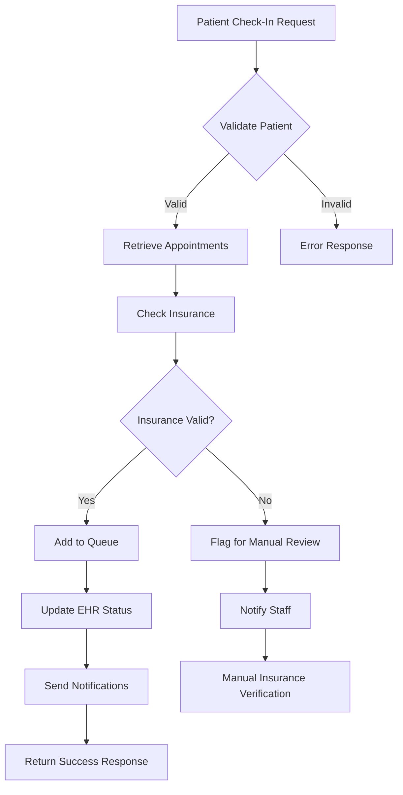

### Apache Kafka Integration

#### Real-Time Event Streaming
```typescript
// Kafka producer for check-in events
import { Kafka, Producer } from 'kafkajs';

class CheckInEventProducer {
  private kafka: Kafka;
  private producer: Producer;

  constructor() {
    this.kafka = new Kafka({
      clientId: 'checkin-service',
      brokers: [
        'kafka-1# Check-In Methods Design

## Technical Architecture Overview

### System Architecture Diagram

```
┌─────────────────┐    ┌─────────────────┐    ┌─────────────────┐
│ React Native    │    │ React/NextJS    │    │  Kiosk Client   │
│ Mobile Apps     │    │ Web Portal      │    │  (Electron)     │
│ (iOS/Android)   │    │                 │    │                 │
└─────────┬───────┘    └─────────┬───────┘    └─────────┬───────┘
          │                      │                      │
          └──────────────────────┼──────────────────────┘
                                 │
                    ┌─────────────────┐
                    │  AWS API        │
                    │  Gateway        │
                    │  (Rate Limiting │
                    │   & Security)   │
                    └─────────┬───────┘
                              │
              ┌───────────────┼───────────────┐
              │               │               │
    ┌─────────▼───────┐ ┌─────▼─────┐ ┌─────────▼───────┐
    │  Check-In       │ │  Queue    │ │  Notification   │
    │  Service        │ │  Service  │ │  Service        │
    │  (Node.js/TS)   │ │(Node.js)  │ │ (AWS SNS/SES)   │
    └─────────┬───────┘ └─────┬─────┘ └─────────┬───────┘
              │               │               │
              └───────────────┼───────────────┘
                              │
                    ┌─────────▼───────┐
                    │  Apache Kafka   │
                    │  Message Queue  │
                    └─────────┬───────┘
                              │
                    ┌─────────▼───────┐
                    │  Integration    │
                    │  Layer (HL7     │
                    │  FHIR/REST)     │
                    └─────────┬───────┘
                              │
              ┌───────────────┼───────────────┐
              │               │               │
    ┌─────────▼───────┐ ┌─────▼─────┐ ┌─────────▼───────┐
    │  EHR/PMS        │ │ Insurance │ │   Payment       │
    │  (HL7 FHIR)     │ │ EDI APIs  │ │   Gateway       │
    └─────────────────┘ └───────────┘ └─────────────────┘
                              │
                    ┌─────────▼───────┐
                    │  PostgreSQL     │
                    │  (Encrypted)    │
                    │  + Redis Cache  │
                    │  + Redshift DW  │
                    └─────────────────┘
```

### Core Components

#### Check-In Service (Node.js/TypeScript)
```typescript
// TypeScript-based check-in service with AWS integration
import { SNSClient, PublishCommand } from '@aws-sdk/client-sns';
import { SESClient, SendEmailCommand } from '@aws-sdk/client-ses';
import { KafkaJS } from 'kafkajs';

class CheckInService {
  private queueService: QueueService;
  private snsClient: SNSClient;
  private sesClient: SESClient;
  private kafkaProducer: KafkaJS.Producer;
  private ehrIntegration: FHIRIntegration;
  private insuranceService: EDIInsuranceService;

  async processCheckIn(request: CheckInRequest): Promise<CheckInResult> {
    // 1. Validate check-in eligibility with type safety
    const validation = await this.validateCheckIn(request);
    if (!validation.valid) {
      throw new CheckInError(validation.reason, validation.code);
    }

    // 2. Verify insurance using EDI transactions
    const insuranceResult = await this.insuranceService.verifyEligibility({
      patientId: request.patientId,
      insuranceInfo: request.insuranceCardData
    });
    
    // 3. Add to queue with Kafka event publishing
    const queuePosition = await this.queueService.addToQueue({
      patientId: request.patientId,
      appointmentId: request.appointmentId,
      departmentId: request.departmentId,
      priority: request.priority || 'normal',
      checkInMethod: request.method,
      insuranceStatus: insuranceResult.status
    });

    // 4. Publish check-in event to Kafka for real-time updates
    await this.kafkaProducer.send({
      topic: 'patient-checkin-events',
      messages: [{
        key: request.patientId,
        value: JSON.stringify({
          event: 'patient-checked-in',
          patientId: request.patientId,
          queuePosition: queuePosition.position,
          timestamp: new Date().toISOString(),
          facilityId: request.facilityId
        })
      }]
    });

    // 5. Send multi-channel notifications
    await this.sendCheckInNotifications(request.patientId, queuePosition);

    // 6. Update EHR via HL7 FHIR
    await this.ehrIntegration.updateAppointmentStatus(
      request.appointmentId, 
      'arrived'
    );

    // 7. Store analytics data in Redshift
    await this.analyticsService.recordCheckInEvent({
      patientId: request.patientId,
      method: request.method,
      duration: Date.now() - request.startTime,
      success: true
    });

    return {
      success: true,
      queuePosition: queuePosition.position,
      estimatedWait: queuePosition.estimatedWait,
      queueNumber: queuePosition.queueNumber,
      trackingUrl: this.generateTrackingUrl(queuePosition.queueNumber),
      insuranceVerified: insuranceResult.verified,
      copayAmount: insuranceResult.copayAmount
    };
  }

  private async sendCheckInNotifications(
    patientId: string, 
    queueData: QueuePosition
  ): Promise<void> {
    const patient = await this.getPatientContactInfo(patientId);
    
    // AWS SNS for push notifications
    if (patient.pushToken) {
      await this.snsClient.send(new PublishCommand({
        TargetArn: patient.pushToken,
        Message: JSON.stringify({
          title: 'Check-in Confirmed',
          body: `You're #${queueData.position} in line. Estimated wait: ${queueData.estimatedWait} minutes`,
          data: { queueNumber: queueData.queueNumber }
        })
      }));
    }

    // AWS SES for email notifications
    if (patient.email) {
      await this.sesClient.send(new SendEmailCommand({
        Source: 'noreply@healthqueue.com',
        Destination: { ToAddresses: [patient.email] },
        Message: {
          Subject: { Data: 'Check-in Confirmation' },
          Body: {
            Html: { Data: this.generateEmailTemplate(queueData) }
          }
        }
      }));
    }

    // Third-party SMS via Twilio/similar
    if (patient.phone) {
      await this.smsService.sendSMS(patient.phone, 
        `Check-in confirmed! You're #${queueData.position}. Est. wait: ${queueData.estimatedWait}min. Track: ${this.generateTrackingUrl(queueData.queueNumber)}`
      );
    }
  }
}
```

## Mobile App Design (React Native)

### Cross-Platform Architecture

#### React Native Implementation
```typescript
// React Native check-in component with TypeScript
import React, { useState, useEffect } from 'react';
import { View, Text, TouchableOpacity, Alert } from 'react-native';
import { useWebSocket } from '@react-native-async-storage/async-storage';
import { checkInAPI } from '../services/api';

interface CheckInScreenProps {
  navigation: any;
  route: any;
}

const CheckInScreen: React.FC<CheckInScreenProps> = ({ navigation, route }) => {
  const [appointments, setAppointments] = useState<Appointment[]>([]);
  const [loading, setLoading] = useState(false);
  const [wsConnected, setWsConnected] = useState(false);

  // WebSocket connection for real-time updates
  const { connect, disconnect, sendMessage } = useWebSocket({
    url: 'wss://api.healthqueue.com/ws',
    onMessage: handleRealtimeUpdate,
    onConnect: () => setWsConnected(true),
    onDisconnect: () => setWsConnected(false)
  });

  useEffect(() => {
    loadTodaysAppointments();
    connect();
    return () => disconnect();
  }, []);

  const handleCheckIn = async (appointmentId: string): Promise<void> => {
    setLoading(true);
    try {
      // Get current location for geofencing
      const location = await getCurrentLocation();
      
      const result = await checkInAPI.processCheckIn({
        appointmentId,
        method: 'mobile-app',
        deviceInfo: await getDeviceInfo(),
        location: {
          latitude: location.coords.latitude,
          longitude: location.coords.longitude,
          accuracy: location.coords.accuracy
        }
      });
      
      // Navigate to queue tracking with real-time updates
      navigation.navigate('QueueTracking', { 
        queueNumber: result.queueNumber,
        estimatedWait: result.estimatedWait 
      });

      // Send success event to Kafka via WebSocket
      sendMessage({
        type: 'checkin-completed',
        appointmentId,
        timestamp: new Date().toISOString()
      });

    } catch (error) {
      Alert.alert('Check-in Failed', error.message);
    } finally {
      setLoading(false);
    }
  };

  const handleRealtimeUpdate = (message: WebSocketMessage): void => {
    switch (message.type) {
      case 'queue-position-updated':
        updateQueuePosition(message.data);
        break;
      case 'appointment-ready':
        showAppointmentReadyAlert(message.data);
        break;
      case 'wait-time-updated':
        updateEstimatedWaitTime(message.data);
        break;
    }
  };

  return (
    <View style={styles.container}>
      <ConnectionIndicator connected={wsConnected} />
      <AppointmentList 
        appointments={appointments}
        onCheckIn={handleCheckIn}
        loading={loading}
      />
    </View>
  );
};
```

#### Native Platform Integrations
```typescript
// iOS-specific integrations using Swift bridge
interface iOSNativeFeatures {
  faceId: boolean;
  touchId: boolean;
  healthKit: boolean;
  coreLocation: boolean;
  pushNotifications: boolean;
}

// Android-specific integrations using Kotlin bridge
interface AndroidNativeFeatures {
  fingerprint: boolean;
  faceUnlock: boolean;
  googleFit: boolean;
  fusedLocation: boolean;
  firebaseMessaging: boolean;
}

// Cross-platform abstraction layer
class MobileIntegrationService {
  async authenticateWithBiometrics(): Promise<BiometricResult> {
    if (Platform.OS === 'ios') {
      return await this.iosAuthService.authenticateWithFaceID();
    } else {
      return await this.androidAuthService.authenticateWithFingerprint();
    }
  }

  async requestLocationPermissions(): Promise<PermissionResult> {
    const permission = await PermissionsAndroid.request(
      PermissionsAndroid.PERMISSIONS.ACCESS_FINE_LOCATION
    );
    return { granted: permission === 'granted' };
  }
}
```

## QR Code Implementation

### QR Code Generation and Security

#### Secure QR Code Design
```typescript
// QR code generation with security
class QRCodeService {
  async generateFacilityQRCode(facilityId: string): Promise<QRCodeData> {
    const payload = {
      facilityId,
      timestamp: Date.now(),
      nonce: generateSecureNonce(),
      checksum: generateChecksum(facilityId + Date.now())
    };

    const encryptedPayload = await encrypt(JSON.stringify(payload));
    const qrCodeUrl = `${BASE_URL}/checkin/qr/${encryptedPayload}`;

    return {
      url: qrCodeUrl,
      qrCodeImage: await generateQRCodeImage(qrCodeUrl),
      expirationTime: Date.now() + (24 * 60 * 60 * 1000), // 24 hours
      facilityId
    };
  }

  async validateQRCode(encryptedPayload: string): Promise<QRValidationResult> {
    try {
      const decrypted = await decrypt(encryptedPayload);
      const payload = JSON.parse(decrypted);

      // Validate timestamp (not older than 24 hours)
      if (Date.now() - payload.timestamp > 24 * 60 * 60 * 1000) {
        return { valid: false, reason: 'QR code expired' };
      }

      // Validate checksum
      const expectedChecksum = generateChecksum(payload.facilityId + payload.timestamp);
      if (payload.checksum !== expectedChecksum) {
        return { valid: false, reason: 'Invalid QR code' };
      }

      return { valid: true, facilityId: payload.facilityId };
    } catch (error) {
      return { valid: false, reason: 'Malformed QR code' };
    }
  }
}
```

## Web Portal Design (React/NextJS)

### NextJS Implementation

#### Server-Side Rendering for Performance
```typescript
// NextJS pages with server-side rendering for SEO and performance
import { GetServerSideProps } from 'next';
import { useState, useEffect } from 'react';
import { useWebSocket } from '../hooks/useWebSocket';

interface CheckInPageProps {
  initialAppointments: Appointment[];
  facilityInfo: FacilityInfo;
}

const CheckInPage: React.FC<CheckInPageProps> = ({ 
  initialAppointments, 
  facilityInfo 
}) => {
  const [appointments, setAppointments] = useState(initialAppointments);
  const { wsStatus, sendMessage } = useWebSocket();

  const handleWebCheckIn = async (appointmentId: string): Promise<void> => {
    try {
      const response = await fetch('/api/checkin', {
        method: 'POST',
        headers: { 'Content-Type': 'application/json' },
        body: JSON.stringify({
          appointmentId,
          method: 'web-portal',
          facilityId: facilityInfo.id,
          timestamp: new Date().toISOString()
        })
      });

      if (!response.ok) {
        throw new Error(`Check-in failed: ${response.statusText}`);
      }

      const result = await response.json();
      
      // Navigate to queue tracking page
      window.location.href = `/queue-tracking?number=${result.queueNumber}`;
      
    } catch (error) {
      console.error('Check-in error:', error);
      // Show user-friendly error message
    }
  };

  return (
    <div className="checkin-container">
      <FacilityHeader facility={facilityInfo} />
      <AppointmentGrid 
        appointments={appointments}
        onCheckIn={handleWebCheckIn}
        wsConnected={wsStatus === 'connected'}
      />
      <QueueStatusBar facilityId={facilityInfo.id} />
    </div>
  );
};

// Server-side data fetching
export const getServerSideProps: GetServerSideProps = async (context) => {
  const { facilityId, patientId } = context.query;
  
  const [appointments, facilityInfo] = await Promise.all([
    getPatientAppointments(patientId as string),
    getFacilityInfo(facilityId as string)
  ]);

  return {
    props: {
      initialAppointments: appointments,
      facilityInfo
    }
  };
};
```

#### Progressive Web App (PWA) Features
```typescript
// PWA service worker for offline capability
self.addEventListener('fetch', (event: FetchEvent) => {
  if (event.request.url.includes('/api/checkin')) {
    event.respondWith(
      fetch(event.request)
        .catch(() => {
          // Offline check-in fallback
          return new Response(JSON.stringify({
            offline: true,
            message: 'Check-in saved locally. Will sync when online.'
          }), {
            headers: { 'Content-Type': 'application/json' }
          });
        })
    );
  }
});

// Offline check-in storage
class OfflineCheckInManager {
  async saveOfflineCheckIn(checkInData: CheckInRequest): Promise<void> {
    const offlineCheckIns = await this.getOfflineCheckIns();
    offlineCheckIns.push({
      ...checkInData,
      id: generateUUID(),
      timestamp: Date.now(),
      status: 'pending-sync'
    });
    
    await localStorage.setItem('offline-checkins', JSON.stringify(offlineCheckIns));
  }

  async syncOfflineCheckIns(): Promise<SyncResult[]> {
    const offlineCheckIns = await this.getOfflineCheckIns();
    const results = [];

    for (const checkIn of offlineCheckIns) {
      try {
        await this.apiService.processCheckIn(checkIn);
        results.push({ id: checkIn.id, success: true });
      } catch (error) {
        results.push({ id: checkIn.id, success: false, error: error.message });
      }
    }

    // Clear successful check-ins
    const failedCheckIns = offlineCheckIns.filter((_, index) => 
      !results[index].success
    );
    await localStorage.setItem('offline-checkins', JSON.stringify(failedCheckIns));

    return results;
  }
}
```

## Data Architecture and Database Design

### PostgreSQL Schema Design

#### Core Check-In Tables
```sql
-- Encrypted patient check-in records
CREATE TABLE patient_checkins (
    id UUID PRIMARY KEY DEFAULT gen_random_uuid(),
    patient_id VARCHAR(255) NOT NULL,
    appointment_id VARCHAR(255),
    facility_id VARCHAR(255) NOT NULL,
    department_id VARCHAR(255) NOT NULL,
    checkin_method VARCHAR(50) NOT NULL, -- mobile-app, qr-code, kiosk, web-portal, voice
    checkin_timestamp TIMESTAMPTZ NOT NULL DEFAULT NOW(),
    queue_number VARCHAR(20) NOT NULL,
    queue_position INTEGER NOT NULL,
    estimated_wait_minutes INTEGER,
    status VARCHAR(50) DEFAULT 'checked-in', -- checked-in, in-queue, called, completed, cancelled
    
    -- Encrypted PHI fields
    encrypted_patient_name TEXT, -- AES-256 encrypted
    encrypted_phone TEXT,        -- AES-256 encrypted
    encrypted_email TEXT,        -- AES-256 encrypted
    
    -- Insurance and payment
    insurance_verified BOOLEAN DEFAULT FALSE,
    copay_amount DECIMAL(10,2),
    insurance_status VARCHAR(50), -- verified, pending, failed
    
    -- Audit and compliance
    ip_address INET,
    user_agent TEXT,
    session_id VARCHAR(255),
    
    -- Indexes for performance
    CONSTRAINT fk_facility FOREIGN KEY (facility_id) REFERENCES facilities(id),
    CONSTRAINT fk_department FOREIGN KEY (department_id) REFERENCES departments(id)
);

-- Indexes for optimal query performance
CREATE INDEX idx_checkins_facility_date ON patient_checkins (facility_id, DATE(checkin_timestamp));
CREATE INDEX idx_checkins_queue_status ON patient_checkins (queue_number, status);
CREATE INDEX idx_checkins_patient_id ON patient_checkins (patient_id);

-- Audit table for HIPAA compliance
CREATE TABLE checkin_audit_log (
    id UUID PRIMARY KEY DEFAULT gen_random_uuid(),
    checkin_id UUID REFERENCES patient_checkins(id),
    action VARCHAR(100) NOT NULL,
    performed_by VARCHAR(255),
    performed_at TIMESTAMPTZ NOT NULL DEFAULT NOW(),
    old_values JSONB,
    new_values JSONB,
    ip_address INET,
    user_agent TEXT
);
```

### Redis Caching Strategy

#### Multi-Level Caching Implementation
```typescript
// Redis caching patterns for check-in performance
class CheckInCacheService {
  private redisCluster: RedisClusterType;
  
  constructor() {
    this.redisCluster = new Redis.Cluster([
      { host: 'cache-1.healthqueue.com', port: 6379 },
      { host: 'cache-2.healthqueue.com', port: 6379 },
      { host: 'cache-3.healthqueue.com', port: 6379 }
    ]);
  }

  // Cache patient appointments for quick lookup
  async cachePatientAppointments(
    patientId: string, 
    appointments: Appointment[]
  ): Promise<void> {
    const cacheKey = `appointments:${patientId}:${this.getTodayKey()}`;
    
    await this.redisCluster.setex(
      cacheKey, 
      1800, // 30 minutes TTL
      JSON.stringify(appointments)
    );
  }

  // Cache facility queue statistics
  async cacheFacilityQueueStats(
    facilityId: string, 
    stats: QueueStats
  ): Promise<void> {
    const cacheKey = `queue-stats:${facilityId}`;
    
    await this.redisCluster.hset(cacheKey, {
      totalInQueue: stats.totalInQueue,
      averageWaitTime: stats.averageWaitTime,
      lastUpdated: Date.now()
    });
    
    await this.redisCluster.expire(cacheKey, 300); // 5 minutes TTL
  }

  // Session management for web portal
  async createCheckInSession(
    sessionId: string, 
    sessionData: CheckInSession
  ): Promise<void> {
    await this.redisCluster.setex(
      `session:${sessionId}`,
      3600, // 1 hour TTL
      JSON.stringify(sessionData)
    );
  }
}
```

#### Kiosk Software Architecture
```typescript
// Kiosk application design
class KioskApplication {
  private screenSaver: ScreenSaverService;
  private accessibilityService: AccessibilityService;
  private maintenanceMode: MaintenanceService;

  async initializeKiosk(): Promise<void> {
    // Initialize hardware components
    await this.hardwareManager.initialize();
    
    // Set up accessibility features
    await this.accessibilityService.configure({
      voiceGuidance: true,
      largeText: true,
      highContrast: true,
      screenReader: true
    });

    // Configure automatic maintenance
    this.scheduleMaintenanceTasks();
    
    // Start health monitoring
    this.startHealthMonitoring();
  }

  private scheduleMaintenanceTasks(): void {
    // Clear cache and temporary files
    schedule('0 2 * * *', () => this.performNightlyMaintenance());
    
    // Hardware diagnostics
    schedule('0 */4 * * *', () => this.runHardwareDiagnostics());
    
    // Software updates
    schedule('0 3 * * 0', () => this.checkForUpdates());
  }
}
```

## Voice-Assisted Check-In Design

### Speech Recognition Integration

#### Voice Interface Design
```typescript
// Voice recognition service
class VoiceCheckInService {
  private speechRecognition: SpeechRecognitionService;
  private naturalLanguageProcessor: NLPService;

  async handleVoiceInput(audioInput: AudioData): Promise<VoiceResponse> {
    // Convert speech to text
    const transcript = await this.speechRecognition.process(audioInput);
    
    // Extract intent and entities
    const intent = await this.naturalLanguageProcessor.extractIntent(transcript);
    
    // Process based on intent
    switch (intent.action) {
      case 'check_in':
        return await this.processVoiceCheckIn(intent.entities);
      case 'get_status':
        return await this.getQueueStatus(intent.entities);
      case 'need_help':
        return await this.requestAssistance();
      default:
        return this.provideClarification();
    }
  }

  private async processVoiceCheckIn(entities: VoiceEntities): Promise<VoiceResponse> {
    const patientInfo = {
      name: entities.patientName,
      birthDate: entities.birthDate,
      phone: entities.phoneNumber
    };

    const appointments = await this.findAppointments(patientInfo);
    
    if (appointments.length === 0) {
      return {
        speech: "I couldn't find any appointments for today. Would you like me to help you schedule one?",
        action: 'offer_scheduling'
      };
    }

    if (appointments.length === 1) {
      return await this.confirmSingleAppointment(appointments[0]);
    }

    return this.requestAppointmentSelection(appointments);
  }
}
```

## Integration Layer Design

### Check-In Data Flow

#### Multi-System Integration Flow


#### Data Synchronization Strategy
```typescript
// Multi-system data synchronization
interface CheckInDataSync {
  ehrUpdate: {
    appointmentStatus: 'checked-in';
    checkInTime: string;
    checkInMethod: string;
    queuePosition: number;
  };
  queueUpdate: {
    patientId: string;
    estimatedWait: number;
    priority: 'normal' | 'urgent' | 'emergency';
    notes: string;
  };
  insuranceUpdate: {
    verificationStatus: 'verified' | 'pending' | 'failed';
    copayAmount: number;
    coverageDetails: InsuranceCoverage;
  };
}

class CheckInDataSynchronizer {
  async syncCheckInData(checkInData: CheckInDataSync): Promise<SyncResult> {
    const syncTasks = [
      this.updateEHRStatus(checkInData.ehrUpdate),
      this.updateQueuePosition(checkInData.queueUpdate),
      this.updateInsuranceInfo(checkInData.insuranceUpdate)
    ];

### Apache Kafka Integration

#### Real-Time Event Streaming
```typescript
// Kafka producer for check-in events
import { Kafka, Producer } from 'kafkajs';

class CheckInEventProducer {
  private kafka: Kafka;
  private producer: Producer;

  constructor() {
    this.kafka = new Kafka({
      clientId: 'checkin-service',
      brokers: [
        'kafka-1.healthqueue.com:9092',
        'kafka-2.healthqueue.com:9092',
        'kafka-3.healthqueue.com:9092'
      ],
      ssl: true,
      sasl: {
        mechanism: 'scram-sha-256',
        username: process.env.KAFKA_USERNAME!,
        password: process.env.KAFKA_PASSWORD!
      }
    });
    
    this.producer = this.kafka.producer({
      maxInFlightRequests: 1,
      idempotent: true,
      transactionTimeout: 30000
    });
  }

  async publishCheckInEvent(event: CheckInEvent): Promise<void> {
    await this.producer.send({
      topic: 'patient-checkin-events',
      messages: [{
        key: event.patientId,
        value: JSON.stringify(event),
        partition: this.getPartitionForFacility(event.facilityId),
        headers: {
          'event-type': event.eventType,
          'facility-id': event.facilityId,
          'timestamp': event.timestamp.toString()
        }
      }]
    });
  }

  // Event types for different check-in scenarios
  async publishEvents(patientId: string, events: CheckInEventData): Promise<void> {
    const eventPromises = [
      // Check-in initiated
      this.publishCheckInEvent({
        eventType: 'checkin-initiated',
        patientId,
        facilityId: events.facilityId,
        method: events.method,
        timestamp: new Date(),
        data: events.initiationData
      }),
      
      // Queue position assigned
      this.publishCheckInEvent({
        eventType: 'queue-position-assigned',
        patientId,
        facilityId: events.facilityId,
        queueNumber: events.queueNumber,
        position: events.position,
        estimatedWait: events.estimatedWait,
        timestamp: new Date()
      }),
      
      // Real-time analytics event
      this.publishCheckInEvent({
        eventType: 'checkin-analytics',
        facilityId: events.facilityId,
        method: events.method,
        duration: events.processingDuration,
        success: events.success,
        timestamp: new Date()
      })
    ];

    await Promise.all(eventPromises);
  }
}
```

### Amazon Redshift Data Warehouse

#### Analytics Data Pipeline
```typescript
// Data pipeline from Kafka to Redshift for analytics
class CheckInAnalyticsPipeline {
  private redshiftClient: RedshiftClient;
  private s3Client: S3Client;

  async processCheckInAnalytics(events: CheckInEvent[]): Promise<void> {
    // Transform events for analytics
    const analyticsData = events.map(event => ({
      checkin_id: event.id,
      facility_id: event.facilityId,
      department_id: event.departmentId,
      checkin_method: event.method,
      checkin_date: event.timestamp.toISOString().split('T')[0],
      checkin_hour: event.timestamp.getHours(),
      day_of_week: event.timestamp.getDay(),
      processing_duration_ms: event.processingDuration,
      queue_position: event.queuePosition,
      estimated_wait_minutes: event.estimatedWait,
      actual_wait_minutes: event.actualWait,
      insurance_verified: event.insuranceVerified,
      success: event.success,
      error_category: event.errorCategory
    }));

    // Batch insert to Redshift via S3 staging
    await this.loadToRedshift(analyticsData);
  }

  private async loadToRedshift(data: AnalyticsRecord[]): Promise<void> {
    // Stage data in S3
    const s3Key = `checkin-analytics/${Date.now()}.json`;
    await this.s3Client.putObject({
      Bucket: 'healthqueue-analytics-staging',
      Key: s3Key,
      Body: JSON.stringify(data),
      ServerSideEncryption: 'AES256'
    });

    // Copy from S3 to Redshift
    await this.redshiftClient.query(`
      COPY checkin_analytics_fact
      FROM 's3://healthqueue-analytics-staging/${s3Key}'
      IAM_ROLE 'arn:aws:iam::account:role/RedshiftLoadRole'
      JSON 'auto'
      TIMEFORMAT 'YYYY-MM-DD HH:MI:SS'
      REGION 'us-east-1'
    `);
  }
}
```

## Integration Layer Design

### HL7 FHIR Integration

#### FHIR R4 Implementation
```typescript
// HL7 FHIR integration for EHR connectivity
import { FhirApi, Bundle, Patient, Appointment } from '@smile-cdr/fhirts';

class FHIRIntegrationService {
  private fhirClient: FhirApi;

  constructor() {
    this.fhirClient = new FhirApi({
      baseUrl: process.env.FHIR_BASE_URL!,
      auth: {
        type: 'oauth2',
        clientId: process.env.FHIR_CLIENT_ID!,
        clientSecret: process.env.FHIR_CLIENT_SECRET!,
        tokenUrl: process.env.FHIR_TOKEN_URL!,
        scopes: ['patient/read', 'appointment/read', 'appointment/write']
      }
    });
  }

  async getPatientAppointments(patientId: string, date: Date): Promise<Appointment[]> {
    const searchParams = {
      patient: patientId,
      date: date.toISOString().split('T')[0],
      status: 'booked,arrived,fulfilled',
      _include: 'Appointment:practitioner,Appointment:location'
    };

    const bundle = await this.fhirClient.search('Appointment', searchParams);
    return this.transformFHIRAppointments(bundle);
  }

  async updateAppointmentStatus(
    appointmentId: string, 
    status: 'arrived' | 'fulfilled' | 'cancelled'
  ): Promise<void> {
    const appointment = await this.fhirClient.read('Appointment', appointmentId);
    
    appointment.status = status;
    appointment.meta = {
      ...appointment.meta,
      lastUpdated: new Date().toISOString(),
      source: 'healthqueue-checkin-system'
    };

    await this.fhirClient.update('Appointment', appointmentId, appointment);
    
    // Publish FHIR update event to Kafka
    await this.eventProducer.publishEvent({
      type: 'fhir-appointment-updated',
      appointmentId,
      status,
      timestamp: new Date()
    });
  }

  private transformFHIRAppointments(bundle: Bundle): Appointment[] {
    return bundle.entry?.map(entry => {
      const appointment = entry.resource as Appointment;
      return {
        id: appointment.id!,
        patientId: appointment.participant.find(p => p.actor.reference?.startsWith('Patient/'))?.actor.reference?.split('/')[1],
        providerId: appointment.participant.find(p => p.actor.reference?.startsWith('Practitioner/'))?.actor.reference?.split('/')[1],
        start: appointment.start!,
        end: appointment.end!,
        status: appointment.status,
        appointmentType: appointment.appointmentType?.coding?.[0]?.display,
        reasonCode: appointment.reasonCode?.[0]?.coding?.[0]?.display,
        location: appointment.participant.find(p => p.actor.reference?.startsWith('Location/'))?.actor.reference?.split('/')[1]
      };
    }) || [];
  }
}
```

### AWS Cloud Infrastructure

#### Multi-Region Deployment Architecture
```typescript
// AWS infrastructure configuration with TypeScript CDK
import * as cdk from 'aws-cdk-lib';
import * as ec2 from 'aws-cdk-lib/aws-ec2';
import * as ecs from 'aws-cdk-lib/aws-ecs';
import * as rds from 'aws-cdk-lib/aws-rds';
import * as elasticache from 'aws-cdk-lib/aws-elasticache';

export class CheckInInfrastructureStack extends cdk.Stack {
  constructor(scope: Construct, id: string, props?: cdk.StackProps) {
    super(scope, id, props);

    // VPC with multi-AZ setup
    const vpc = new ec2.Vpc(this, 'CheckInVPC', {
      maxAzs: 3,
      natGateways: 2,
      subnetConfiguration: [
        {
          cidrMask: 24,
          name: 'public',
          subnetType: ec2.SubnetType.PUBLIC
        },
        {
          cidrMask: 24,
          name: 'private',
          subnetType: ec2.SubnetType.PRIVATE_WITH_EGRESS
        },
        {
          cidrMask: 24,
          name: 'isolated',
          subnetType: ec2.SubnetType.PRIVATE_ISOLATED
        }
      ]
    });

    // RDS PostgreSQL with encryption
    const database = new rds.DatabaseCluster(this, 'CheckInDatabase', {
      engine: rds.DatabaseClusterEngine.auroraPostgres({
        version: rds.AuroraPostgresEngineVersion.VER_14_6
      }),
      credentials: rds.Credentials.fromGeneratedSecret('dbadmin', {
        secretName: 'checkin-db-credentials'
      }),
      instanceProps: {
        instanceType: ec2.InstanceType.of(ec2.InstanceClass.T4G, ec2.InstanceSize.MEDIUM),
        vpc,
        vpcSubnets: { subnetType: ec2.SubnetType.PRIVATE_ISOLATED }
      },
      instances: 2,
      storageEncrypted: true,
      backupRetention: cdk.Duration.days(30),
      deletionProtection: true
    });

    // ElastiCache Redis cluster
    const redisCluster = new elasticache.CfnCacheCluster(this, 'CheckInRedis', {
      cacheNodeType: 'cache.t3.medium',
      engine: 'redis',
      numCacheNodes: 3,
      vpcSecurityGroupIds: [securityGroup.securityGroupId],
      subnetGroupName: redisSubnetGroup.ref,
      transitEncryptionEnabled: true,
      atRestEncryptionEnabled: true
    });

    // ECS Fargate cluster for microservices
    const cluster = new ecs.Cluster(this, 'CheckInCluster', {
      vpc,
      containerInsights: true
    });

    // Check-in service task definition
    const checkInTaskDef = new ecs.FargateTaskDefinition(this, 'CheckInTaskDef', {
      memoryLimitMiB: 1024,
      cpu: 512
    });

    checkInTaskDef.addContainer('checkin-service', {
      image: ecs.ContainerImage.fromRegistry('healthqueue/checkin-service:latest'),
      environment: {
        NODE_ENV: 'production',
        DATABASE_URL: database.clusterEndpoint.socketAddress,
        REDIS_CLUSTER_ENDPOINT: redisCluster.attrRedisEndpointAddress,
        KAFKA_BROKERS: 'kafka-1:9092,kafka-2:9092,kafka-3:9092'
      },
      secrets: {
        DB_PASSWORD: ecs.Secret.fromSecretsManager(database.secret!, 'password')
      },
      logging: ecs.LogDrivers.awsLogs({
        streamPrefix: 'checkin-service',
        logRetention: logs.RetentionDays.ONE_MONTH
      }),
      portMappings: [{ containerPort: 3000 }]
    });
  }
}
```

## Performance Optimization Design

### Microservices Performance Architecture

#### Service Communication Optimization
```typescript
// Optimized service communication with circuit breakers
import CircuitBreaker from 'opossum';

class OptimizedCheckInService {
  private ehrCircuitBreaker: CircuitBreaker;
  private insuranceCircuitBreaker: CircuitBreaker;

  constructor() {
    // Circuit breaker for EHR integration
    this.ehrCircuitBreaker = new CircuitBreaker(this.callEHRService.bind(this), {
      timeout: 5000, // 5 second timeout
      errorThresholdPercentage: 50,
      resetTimeout: 30000, // 30 second reset
      fallback: this.ehrFallback.bind(this)
    });

    // Circuit breaker for insurance verification
    this.insuranceCircuitBreaker = new CircuitBreaker(this.callInsuranceService.bind(this), {
      timeout: 10000, // 10 second timeout for insurance
      errorThresholdPercentage: 30,
      resetTimeout: 60000 // 1 minute reset
    });
  }

  async processOptimizedCheckIn(request: CheckInRequest): Promise<CheckInResult> {
    // Parallel processing for non-dependent operations
    const [queueResult, insuranceResult] = await Promise.allSettled([
      this.queueService.addToQueue(request),
      this.insuranceCircuitBreaker.fire(request.insuranceCardData)
    ]);

    // Handle partial failures gracefully
    const queueData = queueResult.status === 'fulfilled' ? queueResult.value : null;
    const insuranceData = insuranceResult.status === 'fulfilled' ? insuranceResult.value : null;

    if (!queueData) {
      throw new Error('Failed to add patient to queue');
    }

    // Continue with successful operations
    const result: CheckInResult = {
      success: true,
      queueNumber: queueData.queueNumber,
      position: queueData.position,
      estimatedWaitTime: queueData.estimatedWait,
      insuranceVerified: insuranceData?.verified || false,
      warnings: insuranceResult.status === 'rejected' ? ['Insurance verification unavailable'] : []
    };

    // Async operations that don't block user response
    setImmediate(async () => {
      await this.publishKafkaEvents(request, result);
      await this.updateAnalytics(request, result);
      await this.ehrCircuitBreaker.fire(request.appointmentId, 'arrived');
    });

    return result;
  }

  private async ehrFallback(appointmentId: string): Promise<void> {
    // Queue EHR update for when service recovers
    await this.queueEHRUpdate(appointmentId, 'arrived');
  }
}
```

### Database Performance Optimization

#### PostgreSQL Performance Tuning
```sql
-- Optimized indexes for check-in queries
CREATE INDEX CONCURRENTLY idx_checkins_facility_status_time 
ON patient_checkins (facility_id, status, checkin_timestamp) 
WHERE status IN ('checked-in', 'in-queue');

-- Partial index for active queues only
CREATE INDEX CONCURRENTLY idx_active_queue_positions 
ON patient_checkins (facility_id, queue_position, checkin_timestamp) 
WHERE status = 'in-queue';

-- Composite index for real-time queries
CREATE INDEX CONCURRENTLY idx_realtime_updates 
ON patient_checkins (patient_id, status, checkin_timestamp DESC) 
WHERE checkin_timestamp > (NOW() - INTERVAL '24 hours');

-- Performance-optimized view for dashboard queries
CREATE MATERIALIZED VIEW facility_queue_summary AS
SELECT 
    facility_id,
    department_id,
    COUNT(*) as total_in_queue,
    AVG(estimated_wait_minutes) as avg_wait_time,
    MIN(checkin_timestamp) as oldest_checkin,
    MAX(checkin_timestamp) as newest_checkin,
    DATE_TRUNC('hour', checkin_timestamp) as hour_bucket
FROM patient_checkins 
WHERE status = 'in-queue' 
  AND checkin_timestamp > (NOW() - INTERVAL '24 hours')
GROUP BY facility_id, department_id, DATE_TRUNC('hour', checkin_timestamp);

-- Refresh materialized view every 5 minutes
CREATE OR REPLACE FUNCTION refresh_queue_summary()
RETURNS void AS $
BEGIN
    REFRESH MATERIALIZED VIEW CONCURRENTLY facility_queue_summary;
END;
$ LANGUAGE plpgsql;
```

## Error Handling and Resilience Design

### Advanced Error Recovery
```typescript
// Sophisticated error handling with retry policies
class ResilientCheckInService {
  private retryPolicies = {
    network: { maxRetries: 3, backoffMultiplier: 2, initialDelay: 1000 },
    external: { maxRetries: 5, backoffMultiplier: 1.5, initialDelay: 500 },
    database: { maxRetries: 2, backoffMultiplier: 3, initialDelay: 2000 }
  };

  async processCheckInWithResilience(request: CheckInRequest): Promise<CheckInResult> {
    try {
      return await this.executeWithRetry(
        () => this.processCheckIn(request),
        this.retryPolicies.network
      );
    } catch (error) {
      // Implement graceful degradation
      return await this.handleCheckInFailure(request, error);
    }
  }

  private async handleCheckInFailure(
    request: CheckInRequest, 
    error: Error
  ): Promise<CheckInResult> {
    const errorType = this.classifyError(error);
    
    switch (errorType) {
      case 'ehr-unavailable':
        // Check-in without EHR update, queue for later sync
        return await this.checkInWithoutEHR(request);
      
      case 'insurance-service-down':
        // Check-in with manual insurance verification flag
        return await this.checkInWithManualInsurance(request);
      
      case 'queue-service-overloaded':
        // Use estimated position based on historical data
        return await this.checkInWithEstimatedPosition(request);
      
      default:
        // Complete failure - offer offline check-in
        return await this.offerOfflineCheckIn(request);
    }
  }

  private async executeWithRetry<T>(
    operation: () => Promise<T>,
    policy: RetryPolicy
  ): Promise<T> {
    let lastError: Error;
    
    for (let attempt = 1; attempt <= policy.maxRetries + 1; attempt++) {
      try {
        return await operation();
      } catch (error) {
        lastError = error as Error;
        
        if (attempt <= policy.maxRetries) {
          const delay = policy.initialDelay * Math.pow(policy.backoffMultiplier, attempt - 1);
          await this.sleep(delay);
        }
      }
    }
    
    throw lastError!;
  }
}
```

## Real-Time Updates and WebSocket Design

### WebSocket Architecture with Kafka
```typescript
// WebSocket server integrated with Kafka for real-time updates
import { Server as SocketIOServer } from 'socket.io';
import { KafkaJS } from 'kafkajs';

class CheckInWebSocketService {
  private io: SocketIOServer;
  private kafkaConsumer: KafkaJS.Consumer;

  constructor(httpServer: any) {
    this.io = new SocketIOServer(httpServer, {
      cors: {
        origin: process.env.ALLOWED_ORIGINS?.split(','),
        credentials: true
      },
      transports: ['websocket', 'polling']
    });

    this.setupKafkaConsumer();
    this.setupSocketHandlers();
  }

  private async setupKafkaConsumer(): Promise<void> {
    this.kafkaConsumer = this.kafka.consumer({ 
      groupId: 'websocket-consumer-group',
      sessionTimeout: 30000,
      heartbeatInterval: 3000
    });

    await this.kafkaConsumer.connect();
    await this.kafkaConsumer.subscribe({ 
      topics: ['patient-checkin-events', 'queue-updates', 'wait-time-updates'] 
    });

    await this.kafkaConsumer.run({
      eachMessage: async ({ topic, partition, message }) => {
        const event = JSON.parse(message.value!.toString());
        await this.broadcastToClients(event);
      }
    });
  }

  private setupSocketHandlers(): void {
    this.io.on('connection', (socket) => {
      // Authenticate socket connection
      socket.on('authenticate', async (token: string) => {
        try {
          const user = await this.validateToken(token);
          socket.join(`facility-${user.facilityId}`);
          
          if (user.type === 'patient') {
            socket.join(`patient-${user.patientId}`);
          } else if (user.type === 'staff') {
            socket.join(`staff-${user.facilityId}`);
          }
          
          socket.emit('authenticated', { success: true });
        } catch (error) {
          socket.emit('authentication-failed', { error: error.message });
          socket.disconnect();
        }
      });

      // Handle check-in status subscriptions
      socket.on('subscribe-queue-updates', (queueNumber: string) => {
        socket.join(`queue-${queueNumber}`);
      });
    });
  }

  private async broadcastToClients(event: KafkaEvent): Promise<void> {
    switch (event.eventType) {
      case 'checkin-completed':
        this.io.to(`patient-${event.patientId}`).emit('checkin-status', {
          status: 'completed',
          queueNumber: event.queueNumber,
          position: event.position,
          estimatedWait: event.estimatedWait
        });
        break;

      case 'queue-position-updated':
        this.io.to(`queue-${event.queueNumber}`).emit('position-update', {
          newPosition: event.newPosition,
          estimatedWait: event.newEstimatedWait
        });
        break;

      case 'wait-time-changed':
        this.io.to(`facility-${event.facilityId}`).emit('wait-time-update', {
          department: event.departmentId,
          newWaitTime: event.newWaitTime,
          reason: event.changeReason
        });
        break;
    }
  }
}
```
```

## Security and Privacy Design

### Authentication Flow

#### Multi-Factor Authentication for Staff
```typescript
// Staff authentication for check-in management
class StaffAuthenticationService {
  async authenticateStaff(credentials: StaffCredentials): Promise<AuthResult> {
    // Primary authentication
    const primaryAuth = await this.validateCredentials(credentials);
    if (!primaryAuth.valid) {
      return { success: false, reason: 'Invalid credentials' };
    }

    // MFA requirement for PHI access
    if (primaryAuth.user.role === 'staff' || primaryAuth.user.role === 'nurse') {
      const mfaRequired = await this.requiresMFA(primaryAuth.user);
      if (mfaRequired) {
        return {
          success: false,
          requiresMFA: true,
          mfaToken: await this.generateMFAToken(primaryAuth.user.id)
        };
      }
    }

    // Generate session token
    const sessionToken = await this.generateSessionToken(primaryAuth.user);
    
    return {
      success: true,
      user: primaryAuth.user,
      token: sessionToken,
      permissions: await this.getUserPermissions(primaryAuth.user.id)
    };
  }
}
```

#### Patient Privacy Protection
```typescript
// Patient data protection during check-in
class PrivacyProtectionService {
  async protectPatientData(checkInRequest: CheckInRequest): Promise<ProtectedCheckInData> {
    return {
      // Hash sensitive identifiers
      patientHash: await this.hashPatientId(checkInRequest.patientId),
      
      // Mask personal information for logging
      maskedData: {
        firstName: maskString(checkInRequest.firstName, 1, 1), // Show first and last char
        lastName: maskString(checkInRequest.lastName, 1, 1),
        phone: maskPhoneNumber(checkInRequest.phone),
        email: maskEmail(checkInRequest.email)
      },
      
      // Encrypt for storage
      encryptedPHI: await this.encryptPHI({
        fullName: checkInRequest.firstName + ' ' + checkInRequest.lastName,
        contactInfo: {
          phone: checkInRequest.phone,
          email: checkInRequest.email
        }
      }),
      
      // Generate audit trail
      auditEntry: {
        action: 'patient-check-in',
        timestamp: new Date().toISOString(),
        method: checkInRequest.method,
        ipAddress: checkInRequest.ipAddress,
        userAgent: checkInRequest.userAgent
      }
    };
  }
}
```

## Performance and Scalability Design

### Caching Strategy

#### Multi-Level Caching
```typescript
// Caching layer for check-in performance
class CheckInCacheService {
  private redisClient: RedisClient;
  private memoryCache: NodeCache;

  async cacheAppointmentData(patientId: string, appointments: Appointment[]): Promise<void> {
    const cacheKey = `appointments:${patientId}:${getTodayDateString()}`;
    
    // Memory cache for ultra-fast access (5 minutes)
    this.memoryCache.set(cacheKey, appointments, 300);
    
    // Redis cache for shared access (30 minutes)
    await this.redisClient.setex(cacheKey, 1800, JSON.stringify(appointments));
  }

  async getCachedAppointments(patientId: string): Promise<Appointment[] | null> {
    const cacheKey = `appointments:${patientId}:${getTodayDateString()}`;
    
    // Try memory cache first
    let appointments = this.memoryCache.get<Appointment[]>(cacheKey);
    if (appointments) return appointments;
    
    // Fallback to Redis
    const redisData = await this.redisClient.get(cacheKey);
    if (redisData) {
      appointments = JSON.parse(redisData);
      // Populate memory cache
      this.memoryCache.set(cacheKey, appointments, 300);
      return appointments;
    }
    
    return null;
  }
}
```

### Load Balancing and Scaling
```typescript
// Load balancing configuration for check-in services
const loadBalancerConfig = {
  algorithm: 'least-connections',
  healthChecks: {
    endpoint: '/health',
    interval: 30, // seconds
    timeout: 5, // seconds
    failureThreshold: 3
  },
  instances: {
    min: 2,
    max: 10,
    scaleUpThreshold: 70, // CPU percentage
    scaleDownThreshold: 30,
    cooldownPeriod: 300 // seconds
  }
};
```

## Error Handling and Resilience

### Graceful Degradation Strategy

#### Offline Capability Design
```typescript
// Offline check-in capability
class OfflineCheckInService {
  private localStorage: LocalStorageService;
  private syncQueue: SyncQueueService;

  async checkInOffline(checkInData: CheckInRequest): Promise<OfflineCheckInResult> {
    // Store check-in locally
    const offlineCheckIn = {
      id: generateUUID(),
      ...checkInData,
      timestamp: Date.now(),
      status: 'pending-sync'
    };

    await this.localStorage.store('pending-checkins', offlineCheckIn);
    
    // Add to sync queue for when connection returns
    await this.syncQueue.enqueue({
      operation: 'check-in',
      data: offlineCheckIn,
      priority: 'high'
    });

    return {
      success: true,
      offline: true,
      tempQueueNumber: `TEMP-${offlineCheckIn.id.substring(0, 8)}`,
      message: 'Check-in saved. You will receive updates when connection is restored.'
    };
  }

  async syncPendingCheckIns(): Promise<SyncResult[]> {
    const pendingCheckIns = await this.localStorage.getAll('pending-checkins');
    const results = [];

    for (const checkIn of pendingCheckIns) {
      try {
        const result = await this.checkInService.processCheckIn(checkIn);
        await this.localStorage.remove('pending-checkins', checkIn.id);
        
        // Notify patient of successful sync
        await this.notificationService.sendSyncNotification(checkIn.patientId, result);
        
        results.push({ checkInId: checkIn.id, success: true });
      } catch (error) {
        results.push({ checkInId: checkIn.id, success: false, error: error.message });
      }
    }

    return results;
  }
}
```

### Error Recovery Mechanisms
```typescript
// Comprehensive error handling for check-in processes
class CheckInErrorHandler {
  async handleCheckInError(error: CheckInError, request: CheckInRequest): Promise<ErrorResponse> {
    const errorType = this.classifyError(error);
    
    switch (errorType) {
      case 'network-timeout':
        return await this.handleNetworkTimeout(request);
      
      case 'external-service-unavailable':
        return await this.handleServiceUnavailable(request);
      
      case 'patient-not-found':
        return await this.handlePatientNotFound(request);
      
      case 'appointment-not-eligible':
        return await this.handleIneligibleAppointment(request);
      
      case 'insurance-verification-failed':
        return await this.handleInsuranceFailure(request);
      
      default:
        return await this.handleUnknownError(error, request);
    }
  }

  private async handleNetworkTimeout(request: CheckInRequest): Promise<ErrorResponse> {
    // Attempt offline check-in
    const offlineResult = await this.offlineCheckInService.checkInOffline(request);
    
    return {
      success: false,
      canRetry: true,
      offlineOption: offlineResult,
      message: 'Network connection issue. Check-in saved locally and will sync when connection is restored.',
      suggestedAction: 'retry-in-30-seconds'
    };
  }
}
```

## Data Models and Interfaces

### Core Data Models

#### Check-In Request Model
```typescript
interface CheckInRequest {
  // Patient identification
  patientId?: string;
  medicalRecordNumber?: string;
  firstName: string;
  lastName: string;
  dateOfBirth: string;
  phoneNumber?: string;
  email?: string;

  // Appointment details
  appointmentId?: string;
  appointmentTime?: string;
  departmentId: string;
  providerId?: string;
  appointmentType: 'scheduled' | 'walk-in';

  // Check-in context
  method: 'mobile-app' | 'qr-code' | 'kiosk' | 'web-portal' | 'voice' | 'staff-assisted';
  location?: GeolocationData;
  deviceInfo: DeviceInfo;
  
  // Insurance and payment
  insuranceCardData?: InsuranceCardData;
  paymentMethod?: PaymentMethodData;
  
  // Special requirements
  accessibility?: AccessibilityNeeds;
  language?: string;
  notes?: string;
  emergency?: boolean;
}

interface CheckInResult {
  success: boolean;
  queueNumber: string;
  position: number;
  estimatedWaitTime: number; // minutes
  departmentName: string;
  roomNumber?: string;
  trackingUrl: string;
  instructions: string[];
  nextSteps: string[];
  
  // Payment and insurance
  copayAmount?: number;
  insuranceStatus: 'verified' | 'pending' | 'failed';
  
  // Error handling
  warnings?: string[];
  errors?: string[];
}
```

### Integration Models
```typescript
// EHR integration data models
interface EHRAppointment {
  appointmentId: string;
  patientId: string;
  providerId: string;
  facilityId: string;
  scheduledTime: string;
  duration: number;
  status: 'scheduled' | 'confirmed' | 'checked-in' | 'in-progress' | 'completed' | 'cancelled';
  appointmentType: string;
  departmentCode: string;
  reasonForVisit: string;
  insuranceInformation: InsuranceInfo;
}

// Insurance verification model
interface InsuranceVerification {
  patientId: string;
  policyNumber: string;
  groupNumber: string;
  memberNumber: string;
  planName: string;
  effectiveDate: string;
  expirationDate: string;
  copayAmount: number;
  deductibleMet: boolean;
  coverageStatus: 'active' | 'inactive' | 'pending';
  priorAuthRequired: boolean;
  verificationTimestamp: string;
}
```

## User Experience Design

### Responsive Interface Design

#### Mobile-First Approach
```typescript
// Responsive design breakpoints and layouts
const BREAKPOINTS = {
  mobile: '320px',
  tablet: '768px',
  desktop: '1024px',
  kiosk: '1920px'
};

const CheckInInterface = styled.div`
  display: flex;
  flex-direction: column;
  
  @media (min-width: ${BREAKPOINTS.tablet}) {
    flex-direction: row;
    gap: 2rem;
  }
  
  @media (min-width: ${BREAKPOINTS.kiosk}) {
    font-size: 1.25rem; /* Larger text for kiosk visibility */
    padding: 3rem;
  }
`;

// Accessibility considerations
const AccessibilityFeatures = {
  highContrast: true,
  largeText: true,
  voiceNavigation: true,
  screenReaderSupport: true,
  keyboardNavigation: true,
  reducedMotion: true
};
```

### User Flow Optimization
```typescript
// Optimized check-in user flows
const checkInFlows = {
  returningPatient: [
    'biometric-identification', // Face ID, Touch ID, or fingerprint
    'appointment-confirmation',
    'queue-addition',
    'confirmation-display'
  ],
  
  newPatient: [
    'identity-verification',
    'information-collection',
    'insurance-verification',
    'consent-collection',
    'appointment-scheduling-or-queue-join',
    'confirmation-and-instructions'
  ],
  
  emergencyPatient: [
    'triage-assessment',
    'immediate-priority-assignment',
    'clinical-alert',
    'fast-track-queue-addition'
  ]
};
```

## Testing and Quality Assurance Design

### Test Strategy Framework

#### Automated Testing Architecture
```typescript
// Comprehensive testing framework for check-in methods
class CheckInTestSuite {
  // Unit tests for core functionality
  async runUnitTests(): Promise<TestResult[]> {
    return [
      await this.testPatientValidation(),
      await this.testAppointmentRetrieval(),
      await this.testQueueAddition(),
      await this.testNotificationSending(),
      await this.testInsuranceVerification()
    ];
  }

  // Integration tests for external systems
  async runIntegrationTests(): Promise<TestResult[]> {
    return [
      await this.testEHRIntegration(),
      await this.testInsuranceAPIIntegration(),
      await this.testNotificationDelivery(),
      await this.testQueueServiceIntegration()
    ];
  }

  // End-to-end tests for complete user journeys
  async runE2ETests(): Promise<TestResult[]> {
    return [
      await this.testMobileAppCheckIn(),
      await this.testQRCodeCheckIn(),
      await this.testKioskCheckIn(),
      await this.testWebPortalCheckIn(),
      await this.testVoiceCheckIn()
    ];
  }

  // Performance tests for load handling
  async runPerformanceTests(): Promise<PerformanceResult[]> {
    return [
      await this.testConcurrentCheckIns(500), // 500 simultaneous check-ins
      await this.testPeakLoadHandling(1000), // 1000 check-ins per hour
      await this.testResponseTimeUnderLoad(),
      await this.testMemoryUsageOptimization()
    ];
  }
}
```

### User Acceptance Testing
```typescript
// UAT scenarios for check-in methods
const uatScenarios = [
  {
    scenario: 'busy-morning-rush',
    description: 'Test system performance during peak morning hours',
    userTypes: ['scheduled-patients', 'walk-ins', 'emergencies'],
    successCriteria: [
      'check-in-completion-under-30-seconds',
      'accurate-wait-time-estimates',
      'no-system-slowdown'
    ]
  },
  {
    scenario: 'elderly-patient-assistance',
    description: 'Verify accessibility features work for elderly patients',
    userTypes: ['elderly-patients', 'vision-impaired', 'hearing-impaired'],
    successCriteria: [
      'voice-guidance-clarity',
      'large-text-readability',
      'staff-assistance-availability'
    ]
  },
  {
    scenario: 'system-failure-recovery',
    description: 'Test graceful degradation and recovery procedures',
    conditions: ['ehr-system-down', 'network-interruption', 'high-load'],
    successCriteria: [
      'offline-check-in-capability',
      'manual-fallback-procedures',
      'data-consistency-after-recovery'
    ]
  }
];
```

## Monitoring and Analytics Design

### Real-Time Monitoring Dashboard

#### Check-In Analytics
```typescript
// Real-time check-in monitoring and analytics
interface CheckInAnalytics {
  realTimeMetrics: {
    activeCheckIns: number;
    checkInsPerHour: number;
    averageCheckInTime: number;
    successRate: number;
    errorRate: number;
  };
  
  methodBreakdown: {
    mobileApp: { count: number; percentage: number; avgTime: number; };
    qrCode: { count: number; percentage: number; avgTime: number; };
    kiosk: { count: number; percentage: number; avgTime: number; };
    webPortal: { count: number; percentage: number; avgTime: number; };
    voiceAssisted: { count: number; percentage: number; avgTime: number; };
    staffAssisted: { count: number; percentage: number; avgTime: number; };
  };
  
  performanceMetrics: {
    responseTime: { p50: number; p95: number; p99: number; };
    throughput: number; // requests per second
    concurrentUsers: number;
    systemLoad: number; // percentage
  };
  
  errorAnalysis: {
    commonErrors: ErrorFrequency[];
    errorTrends: TimeSeries[];
    resolutionTimes: number[];
  };
}
```

### Predictive Analytics
```typescript
// Machine learning for check-in optimization
class CheckInPredictiveAnalytics {
  async predictOptimalCheckInMethods(facilityData: FacilityMetrics): Promise<Recommendations> {
    const model = await this.loadPredictionModel();
    
    const predictions = await model.predict({
      timeOfDay: facilityData.currentHour,
      dayOfWeek: facilityData.dayOfWeek,
      seasonality: facilityData.seasonalFactors,
      historicalVolume: facilityData.historicalCheckIns,
      staffAvailability: facilityData.staffLevels,
      systemLoad: facilityData.currentLoad
    });

    return {
      recommendedMethods: predictions.optimalMethods,
      expectedVolume: predictions.volumeForecast,
      resourceRequirements: predictions.staffingNeeds,
      potentialBottlenecks: predictions.riskAreas,
      optimizationSuggestions: predictions.improvements
    };
  }
}
```

---

*This design document provides the technical foundation for implementing a comprehensive multi-channel check-in system that prioritizes security, performance, and user experience while maintaining healthcare compliance standards.*