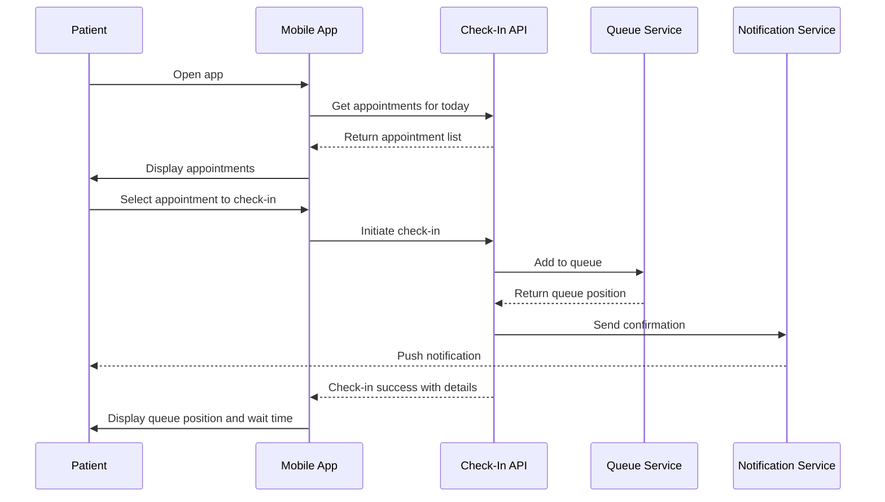
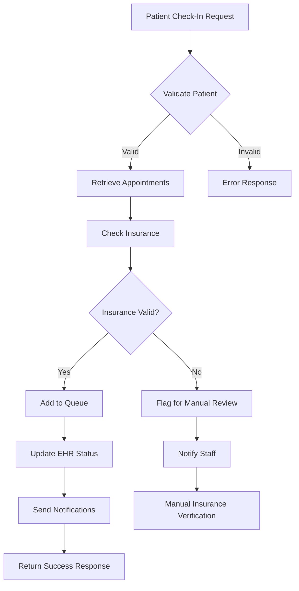

# Check-In Methods Design

## Technical Architecture Overview

### System Architecture Diagram

```
┌─────────────────┐    ┌─────────────────┐    ┌─────────────────┐
│   Mobile App    │    │   Web Portal    │    │  Kiosk Client   │
│                 │    │                 │    │                 │
└─────────┬───────┘    └─────────┬───────┘    └─────────┬───────┘
          │                      │                      │
          └──────────────────────┼──────────────────────┘
                                 │
                    ┌─────────────────┐
                    │  API Gateway    │
                    │  (Rate Limiting │
                    │   & Security)   │
                    └─────────┬───────┘
                              │
              ┌───────────────┼───────────────┐
              │               │               │
    ┌─────────▼───────┐ ┌─────▼─────┐ ┌─────────▼───────┐
    │  Check-In       │ │  Queue    │ │  Notification   │
    │  Service        │ │  Service  │ │  Service        │
    └─────────┬───────┘ └─────┬─────┘ └─────────┬───────┘
              │               │               │
              └───────────────┼───────────────┘
                              │
                    ┌─────────▼───────┐
                    │  Integration    │
                    │  Layer          │
                    └─────────┬───────┘
                              │
              ┌───────────────┼───────────────┐
              │               │               │
    ┌─────────▼───────┐ ┌─────▼─────┐ ┌─────────▼───────┐
    │  EHR/PMS        │ │ Insurance │ │   Payment       │
    │  Integration    │ │ Services  │ │   Gateway       │
    └─────────────────┘ └───────────┘ └─────────────────┘
```

### Core Components

#### Check-In Service
```typescript
// Core check-in service architecture
class CheckInService {
  private queueService: QueueService;
  private notificationService: NotificationService;
  private ehrIntegration: EHRIntegration;
  private insuranceService: InsuranceService;

  async processCheckIn(request: CheckInRequest): Promise<CheckInResult> {
    // 1. Validate check-in eligibility
    const validation = await this.validateCheckIn(request);
    if (!validation.valid) {
      throw new CheckInError(validation.reason);
    }

    // 2. Verify insurance and update patient info
    const insuranceResult = await this.verifyInsurance(request.patientId);
    
    // 3. Add to appropriate queue
    const queuePosition = await this.queueService.addToQueue({
      patientId: request.patientId,
      appointmentId: request.appointmentId,
      departmentId: request.departmentId,
      priority: request.priority || 'normal',
      checkInMethod: request.method
    });

    // 4. Send confirmation notification
    await this.notificationService.sendCheckInConfirmation({
      patientId: request.patientId,
      queuePosition: queuePosition.position,
      estimatedWait: queuePosition.estimatedWait,
      queueNumber: queuePosition.queueNumber
    });

    // 5. Update EHR status
    await this.ehrIntegration.updateAppointmentStatus(
      request.appointmentId, 
      'checked-in'
    );

    return {
      success: true,
      queuePosition: queuePosition.position,
      estimatedWait: queuePosition.estimatedWait,
      queueNumber: queuePosition.queueNumber,
      trackingUrl: this.generateTrackingUrl(queuePosition.queueNumber)
    };
  }
}
```

## Mobile App Design

### User Interface Flow

#### Check-In Flow Sequence


#### Mobile App Components
```typescript
// React Native component structure
interface CheckInScreenProps {
  navigation: NavigationProp;
  route: RouteProp;
}

const CheckInScreen: React.FC<CheckInScreenProps> = ({ navigation, route }) => {
  const [appointments, setAppointments] = useState<Appointment[]>([]);
  const [loading, setLoading] = useState(false);
  const [checkInStatus, setCheckInStatus] = useState<CheckInStatus | null>(null);

  const handleCheckIn = async (appointmentId: string) => {
    setLoading(true);
    try {
      const result = await checkInService.checkIn({
        appointmentId,
        method: 'mobile-app',
        location: await getCurrentLocation()
      });
      
      setCheckInStatus(result);
      navigation.navigate('QueueTracking', { queueNumber: result.queueNumber });
    } catch (error) {
      showErrorAlert(error.message);
    } finally {
      setLoading(false);
    }
  };

  return (
    <SafeAreaView style={styles.container}>
      <AppointmentList 
        appointments={appointments}
        onCheckIn={handleCheckIn}
        loading={loading}
      />
      {checkInStatus && (
        <CheckInConfirmation 
          status={checkInStatus}
          onTrackQueue={() => navigation.navigate('QueueTracking')}
        />
      )}
    </SafeAreaView>
  );
};
```

## QR Code Implementation

### QR Code Generation and Security

#### Secure QR Code Design
```typescript
// QR code generation with security
class QRCodeService {
  async generateFacilityQRCode(facilityId: string): Promise<QRCodeData> {
    const payload = {
      facilityId,
      timestamp: Date.now(),
      nonce: generateSecureNonce(),
      checksum: generateChecksum(facilityId + Date.now())
    };

    const encryptedPayload = await encrypt(JSON.stringify(payload));
    const qrCodeUrl = `${BASE_URL}/checkin/qr/${encryptedPayload}`;

    return {
      url: qrCodeUrl,
      qrCodeImage: await generateQRCodeImage(qrCodeUrl),
      expirationTime: Date.now() + (24 * 60 * 60 * 1000), // 24 hours
      facilityId
    };
  }

  async validateQRCode(encryptedPayload: string): Promise<QRValidationResult> {
    try {
      const decrypted = await decrypt(encryptedPayload);
      const payload = JSON.parse(decrypted);

      // Validate timestamp (not older than 24 hours)
      if (Date.now() - payload.timestamp > 24 * 60 * 60 * 1000) {
        return { valid: false, reason: 'QR code expired' };
      }

      // Validate checksum
      const expectedChecksum = generateChecksum(payload.facilityId + payload.timestamp);
      if (payload.checksum !== expectedChecksum) {
        return { valid: false, reason: 'Invalid QR code' };
      }

      return { valid: true, facilityId: payload.facilityId };
    } catch (error) {
      return { valid: false, reason: 'Malformed QR code' };
    }
  }
}
```

### Web Portal Integration
```typescript
// QR code check-in web portal
const QRCheckInPortal: React.FC = () => {
  const [step, setStep] = useState<'identify' | 'verify' | 'confirm'>('identify');
  const [patientInfo, setPatientInfo] = useState<PatientInfo | null>(null);
  const [appointments, setAppointments] = useState<Appointment[]>([]);

  const handleIdentification = async (identificationData: IdentificationData) => {
    try {
      const patient = await patientService.identifyPatient(identificationData);
      const todayAppointments = await appointmentService.getTodayAppointments(patient.id);
      
      setPatientInfo(patient);
      setAppointments(todayAppointments);
      setStep('verify');
    } catch (error) {
      showErrorMessage('Unable to find patient information. Please check your details.');
    }
  };

  return (
    <div className="qr-checkin-portal">
      {step === 'identify' && (
        <PatientIdentification onSubmit={handleIdentification} />
      )}
      {step === 'verify' && (
        <AppointmentVerification 
          patient={patientInfo}
          appointments={appointments}
          onConfirm={() => setStep('confirm')}
        />
      )}
      {step === 'confirm' && (
        <CheckInConfirmation 
          onComplete={(result) => showQueueDetails(result)}
        />
      )}
    </div>
  );
};
```

## Kiosk Design

### Hardware Integration

#### Kiosk Hardware Requirements
```typescript
// Kiosk hardware interface
interface KioskHardware {
  touchscreen: {
    size: '21-24 inches';
    resolution: '1920x1080 minimum';
    multiTouch: true;
    accessibility: 'height-adjustable';
  };
  peripherals: {
    camera: 'for insurance card scanning';
    printer: 'thermal receipt printer';
    cardReader: 'insurance and payment cards';
    speakers: 'for voice guidance';
    microphone: 'for voice input';
    nfcReader: 'for contactless interactions';
  };
  connectivity: {
    ethernet: 'primary connection';
    wifi: 'backup connection';
    cellular: 'emergency fallback';
  };
}
```

#### Kiosk Software Architecture
```typescript
// Kiosk application design
class KioskApplication {
  private screenSaver: ScreenSaverService;
  private accessibilityService: AccessibilityService;
  private maintenanceMode: MaintenanceService;

  async initializeKiosk(): Promise<void> {
    // Initialize hardware components
    await this.hardwareManager.initialize();
    
    // Set up accessibility features
    await this.accessibilityService.configure({
      voiceGuidance: true,
      largeText: true,
      highContrast: true,
      screenReader: true
    });

    // Configure automatic maintenance
    this.scheduleMaintenanceTasks();
    
    // Start health monitoring
    this.startHealthMonitoring();
  }

  private scheduleMaintenanceTasks(): void {
    // Clear cache and temporary files
    schedule('0 2 * * *', () => this.performNightlyMaintenance());
    
    // Hardware diagnostics
    schedule('0 */4 * * *', () => this.runHardwareDiagnostics());
    
    // Software updates
    schedule('0 3 * * 0', () => this.checkForUpdates());
  }
}
```

## Voice-Assisted Check-In Design

### Speech Recognition Integration

#### Voice Interface Design
```typescript
// Voice recognition service
class VoiceCheckInService {
  private speechRecognition: SpeechRecognitionService;
  private naturalLanguageProcessor: NLPService;

  async handleVoiceInput(audioInput: AudioData): Promise<VoiceResponse> {
    // Convert speech to text
    const transcript = await this.speechRecognition.process(audioInput);
    
    // Extract intent and entities
    const intent = await this.naturalLanguageProcessor.extractIntent(transcript);
    
    // Process based on intent
    switch (intent.action) {
      case 'check_in':
        return await this.processVoiceCheckIn(intent.entities);
      case 'get_status':
        return await this.getQueueStatus(intent.entities);
      case 'need_help':
        return await this.requestAssistance();
      default:
        return this.provideClarification();
    }
  }

  private async processVoiceCheckIn(entities: VoiceEntities): Promise<VoiceResponse> {
    const patientInfo = {
      name: entities.patientName,
      birthDate: entities.birthDate,
      phone: entities.phoneNumber
    };

    const appointments = await this.findAppointments(patientInfo);
    
    if (appointments.length === 0) {
      return {
        speech: "I couldn't find any appointments for today. Would you like me to help you schedule one?",
        action: 'offer_scheduling'
      };
    }

    if (appointments.length === 1) {
      return await this.confirmSingleAppointment(appointments[0]);
    }

    return this.requestAppointmentSelection(appointments);
  }
}
```

## Integration Layer Design

### Check-In Data Flow

#### Multi-System Integration Flow


#### Data Synchronization Strategy
```typescript
// Multi-system data synchronization
interface CheckInDataSync {
  ehrUpdate: {
    appointmentStatus: 'checked-in';
    checkInTime: string;
    checkInMethod: string;
    queuePosition: number;
  };
  queueUpdate: {
    patientId: string;
    estimatedWait: number;
    priority: 'normal' | 'urgent' | 'emergency';
    notes: string;
  };
  insuranceUpdate: {
    verificationStatus: 'verified' | 'pending' | 'failed';
    copayAmount: number;
    coverageDetails: InsuranceCoverage;
  };
}

class CheckInDataSynchronizer {
  async syncCheckInData(checkInData: CheckInDataSync): Promise<SyncResult> {
    const syncTasks = [
      this.updateEHRStatus(checkInData.ehrUpdate),
      this.updateQueuePosition(checkInData.queueUpdate),
      this.updateInsuranceInfo(checkInData.insuranceUpdate)
    ];

    // Execute all updates concurrently with error handling
    const results = await Promise.allSettled(syncTasks);
    
    // Handle partial failures
    const failures = results.filter(r => r.status === 'rejected');
    if (failures.length > 0) {
      await this.handleSyncFailures(failures, checkInData);
    }

    return {
      success: failures.length === 0,
      partialFailure: failures.length > 0 && failures.length < syncTasks.length,
      failedSystems: failures.map(f => f.reason)
    };
  }

  private async handleSyncFailures(
    failures: PromiseRejectedResult[], 
    originalData: CheckInDataSync
  ): Promise<void> {
    // Queue failed operations for retry
    await this.retryQueue.addFailedSync({
      data: originalData,
      failures: failures,
      retryCount: 0,
      nextRetry: Date.now() + 30000 // 30 seconds
    });
    
    // Alert administrators of sync issues
    await this.alertService.notifyAdmins('check-in-sync-failure', {
      failureCount: failures.length,
      affectedPatient: originalData.queueUpdate.patientId
    });
  }
}
```

## Security and Privacy Design

### Authentication Flow

#### Multi-Factor Authentication for Staff
```typescript
// Staff authentication for check-in management
class StaffAuthenticationService {
  async authenticateStaff(credentials: StaffCredentials): Promise<AuthResult> {
    // Primary authentication
    const primaryAuth = await this.validateCredentials(credentials);
    if (!primaryAuth.valid) {
      return { success: false, reason: 'Invalid credentials' };
    }

    // MFA requirement for PHI access
    if (primaryAuth.user.role === 'staff' || primaryAuth.user.role === 'nurse') {
      const mfaRequired = await this.requiresMFA(primaryAuth.user);
      if (mfaRequired) {
        return {
          success: false,
          requiresMFA: true,
          mfaToken: await this.generateMFAToken(primaryAuth.user.id)
        };
      }
    }

    // Generate session token
    const sessionToken = await this.generateSessionToken(primaryAuth.user);
    
    return {
      success: true,
      user: primaryAuth.user,
      token: sessionToken,
      permissions: await this.getUserPermissions(primaryAuth.user.id)
    };
  }
}
```

#### Patient Privacy Protection
```typescript
// Patient data protection during check-in
class PrivacyProtectionService {
  async protectPatientData(checkInRequest: CheckInRequest): Promise<ProtectedCheckInData> {
    return {
      // Hash sensitive identifiers
      patientHash: await this.hashPatientId(checkInRequest.patientId),
      
      // Mask personal information for logging
      maskedData: {
        firstName: maskString(checkInRequest.firstName, 1, 1), // Show first and last char
        lastName: maskString(checkInRequest.lastName, 1, 1),
        phone: maskPhoneNumber(checkInRequest.phone),
        email: maskEmail(checkInRequest.email)
      },
      
      // Encrypt for storage
      encryptedPHI: await this.encryptPHI({
        fullName: checkInRequest.firstName + ' ' + checkInRequest.lastName,
        contactInfo: {
          phone: checkInRequest.phone,
          email: checkInRequest.email
        }
      }),
      
      // Generate audit trail
      auditEntry: {
        action: 'patient-check-in',
        timestamp: new Date().toISOString(),
        method: checkInRequest.method,
        ipAddress: checkInRequest.ipAddress,
        userAgent: checkInRequest.userAgent
      }
    };
  }
}
```

## Performance and Scalability Design

### Caching Strategy

#### Multi-Level Caching
```typescript
// Caching layer for check-in performance
class CheckInCacheService {
  private redisClient: RedisClient;
  private memoryCache: NodeCache;

  async cacheAppointmentData(patientId: string, appointments: Appointment[]): Promise<void> {
    const cacheKey = `appointments:${patientId}:${getTodayDateString()}`;
    
    // Memory cache for ultra-fast access (5 minutes)
    this.memoryCache.set(cacheKey, appointments, 300);
    
    // Redis cache for shared access (30 minutes)
    await this.redisClient.setex(cacheKey, 1800, JSON.stringify(appointments));
  }

  async getCachedAppointments(patientId: string): Promise<Appointment[] | null> {
    const cacheKey = `appointments:${patientId}:${getTodayDateString()}`;
    
    // Try memory cache first
    let appointments = this.memoryCache.get<Appointment[]>(cacheKey);
    if (appointments) return appointments;
    
    // Fallback to Redis
    const redisData = await this.redisClient.get(cacheKey);
    if (redisData) {
      appointments = JSON.parse(redisData);
      // Populate memory cache
      this.memoryCache.set(cacheKey, appointments, 300);
      return appointments;
    }
    
    return null;
  }
}
```

### Load Balancing and Scaling
```typescript
// Load balancing configuration for check-in services
const loadBalancerConfig = {
  algorithm: 'least-connections',
  healthChecks: {
    endpoint: '/health',
    interval: 30, // seconds
    timeout: 5, // seconds
    failureThreshold: 3
  },
  instances: {
    min: 2,
    max: 10,
    scaleUpThreshold: 70, // CPU percentage
    scaleDownThreshold: 30,
    cooldownPeriod: 300 // seconds
  }
};
```

## Error Handling and Resilience

### Graceful Degradation Strategy

#### Offline Capability Design
```typescript
// Offline check-in capability
class OfflineCheckInService {
  private localStorage: LocalStorageService;
  private syncQueue: SyncQueueService;

  async checkInOffline(checkInData: CheckInRequest): Promise<OfflineCheckInResult> {
    // Store check-in locally
    const offlineCheckIn = {
      id: generateUUID(),
      ...checkInData,
      timestamp: Date.now(),
      status: 'pending-sync'
    };

    await this.localStorage.store('pending-checkins', offlineCheckIn);
    
    // Add to sync queue for when connection returns
    await this.syncQueue.enqueue({
      operation: 'check-in',
      data: offlineCheckIn,
      priority: 'high'
    });

    return {
      success: true,
      offline: true,
      tempQueueNumber: `TEMP-${offlineCheckIn.id.substring(0, 8)}`,
      message: 'Check-in saved. You will receive updates when connection is restored.'
    };
  }

  async syncPendingCheckIns(): Promise<SyncResult[]> {
    const pendingCheckIns = await this.localStorage.getAll('pending-checkins');
    const results = [];

    for (const checkIn of pendingCheckIns) {
      try {
        const result = await this.checkInService.processCheckIn(checkIn);
        await this.localStorage.remove('pending-checkins', checkIn.id);
        
        // Notify patient of successful sync
        await this.notificationService.sendSyncNotification(checkIn.patientId, result);
        
        results.push({ checkInId: checkIn.id, success: true });
      } catch (error) {
        results.push({ checkInId: checkIn.id, success: false, error: error.message });
      }
    }

    return results;
  }
}
```

### Error Recovery Mechanisms
```typescript
// Comprehensive error handling for check-in processes
class CheckInErrorHandler {
  async handleCheckInError(error: CheckInError, request: CheckInRequest): Promise<ErrorResponse> {
    const errorType = this.classifyError(error);
    
    switch (errorType) {
      case 'network-timeout':
        return await this.handleNetworkTimeout(request);
      
      case 'external-service-unavailable':
        return await this.handleServiceUnavailable(request);
      
      case 'patient-not-found':
        return await this.handlePatientNotFound(request);
      
      case 'appointment-not-eligible':
        return await this.handleIneligibleAppointment(request);
      
      case 'insurance-verification-failed':
        return await this.handleInsuranceFailure(request);
      
      default:
        return await this.handleUnknownError(error, request);
    }
  }

  private async handleNetworkTimeout(request: CheckInRequest): Promise<ErrorResponse> {
    // Attempt offline check-in
    const offlineResult = await this.offlineCheckInService.checkInOffline(request);
    
    return {
      success: false,
      canRetry: true,
      offlineOption: offlineResult,
      message: 'Network connection issue. Check-in saved locally and will sync when connection is restored.',
      suggestedAction: 'retry-in-30-seconds'
    };
  }
}
```

## Data Models and Interfaces

### Core Data Models

#### Check-In Request Model
```typescript
interface CheckInRequest {
  // Patient identification
  patientId?: string;
  medicalRecordNumber?: string;
  firstName: string;
  lastName: string;
  dateOfBirth: string;
  phoneNumber?: string;
  email?: string;

  // Appointment details
  appointmentId?: string;
  appointmentTime?: string;
  departmentId: string;
  providerId?: string;
  appointmentType: 'scheduled' | 'walk-in';

  // Check-in context
  method: 'mobile-app' | 'qr-code' | 'kiosk' | 'web-portal' | 'voice' | 'staff-assisted';
  location?: GeolocationData;
  deviceInfo: DeviceInfo;
  
  // Insurance and payment
  insuranceCardData?: InsuranceCardData;
  paymentMethod?: PaymentMethodData;
  
  // Special requirements
  accessibility?: AccessibilityNeeds;
  language?: string;
  notes?: string;
  emergency?: boolean;
}

interface CheckInResult {
  success: boolean;
  queueNumber: string;
  position: number;
  estimatedWaitTime: number; // minutes
  departmentName: string;
  roomNumber?: string;
  trackingUrl: string;
  instructions: string[];
  nextSteps: string[];
  
  // Payment and insurance
  copayAmount?: number;
  insuranceStatus: 'verified' | 'pending' | 'failed';
  
  // Error handling
  warnings?: string[];
  errors?: string[];
}
```

### Integration Models
```typescript
// EHR integration data models
interface EHRAppointment {
  appointmentId: string;
  patientId: string;
  providerId: string;
  facilityId: string;
  scheduledTime: string;
  duration: number;
  status: 'scheduled' | 'confirmed' | 'checked-in' | 'in-progress' | 'completed' | 'cancelled';
  appointmentType: string;
  departmentCode: string;
  reasonForVisit: string;
  insuranceInformation: InsuranceInfo;
}

// Insurance verification model
interface InsuranceVerification {
  patientId: string;
  policyNumber: string;
  groupNumber: string;
  memberNumber: string;
  planName: string;
  effectiveDate: string;
  expirationDate: string;
  copayAmount: number;
  deductibleMet: boolean;
  coverageStatus: 'active' | 'inactive' | 'pending';
  priorAuthRequired: boolean;
  verificationTimestamp: string;
}
```

## User Experience Design

### Responsive Interface Design

#### Mobile-First Approach
```typescript
// Responsive design breakpoints and layouts
const BREAKPOINTS = {
  mobile: '320px',
  tablet: '768px',
  desktop: '1024px',
  kiosk: '1920px'
};

const CheckInInterface = styled.div`
  display: flex;
  flex-direction: column;
  
  @media (min-width: ${BREAKPOINTS.tablet}) {
    flex-direction: row;
    gap: 2rem;
  }
  
  @media (min-width: ${BREAKPOINTS.kiosk}) {
    font-size: 1.25rem; /* Larger text for kiosk visibility */
    padding: 3rem;
  }
`;

// Accessibility considerations
const AccessibilityFeatures = {
  highContrast: true,
  largeText: true,
  voiceNavigation: true,
  screenReaderSupport: true,
  keyboardNavigation: true,
  reducedMotion: true
};
```

### User Flow Optimization
```typescript
// Optimized check-in user flows
const checkInFlows = {
  returningPatient: [
    'biometric-identification', // Face ID, Touch ID, or fingerprint
    'appointment-confirmation',
    'queue-addition',
    'confirmation-display'
  ],
  
  newPatient: [
    'identity-verification',
    'information-collection',
    'insurance-verification',
    'consent-collection',
    'appointment-scheduling-or-queue-join',
    'confirmation-and-instructions'
  ],
  
  emergencyPatient: [
    'triage-assessment',
    'immediate-priority-assignment',
    'clinical-alert',
    'fast-track-queue-addition'
  ]
};
```

## Testing and Quality Assurance Design

### Test Strategy Framework

#### Automated Testing Architecture
```typescript
// Comprehensive testing framework for check-in methods
class CheckInTestSuite {
  // Unit tests for core functionality
  async runUnitTests(): Promise<TestResult[]> {
    return [
      await this.testPatientValidation(),
      await this.testAppointmentRetrieval(),
      await this.testQueueAddition(),
      await this.testNotificationSending(),
      await this.testInsuranceVerification()
    ];
  }

  // Integration tests for external systems
  async runIntegrationTests(): Promise<TestResult[]> {
    return [
      await this.testEHRIntegration(),
      await this.testInsuranceAPIIntegration(),
      await this.testNotificationDelivery(),
      await this.testQueueServiceIntegration()
    ];
  }

  // End-to-end tests for complete user journeys
  async runE2ETests(): Promise<TestResult[]> {
    return [
      await this.testMobileAppCheckIn(),
      await this.testQRCodeCheckIn(),
      await this.testKioskCheckIn(),
      await this.testWebPortalCheckIn(),
      await this.testVoiceCheckIn()
    ];
  }

  // Performance tests for load handling
  async runPerformanceTests(): Promise<PerformanceResult[]> {
    return [
      await this.testConcurrentCheckIns(500), // 500 simultaneous check-ins
      await this.testPeakLoadHandling(1000), // 1000 check-ins per hour
      await this.testResponseTimeUnderLoad(),
      await this.testMemoryUsageOptimization()
    ];
  }
}
```

### User Acceptance Testing
```typescript
// UAT scenarios for check-in methods
const uatScenarios = [
  {
    scenario: 'busy-morning-rush',
    description: 'Test system performance during peak morning hours',
    userTypes: ['scheduled-patients', 'walk-ins', 'emergencies'],
    successCriteria: [
      'check-in-completion-under-30-seconds',
      'accurate-wait-time-estimates',
      'no-system-slowdown'
    ]
  },
  {
    scenario: 'elderly-patient-assistance',
    description: 'Verify accessibility features work for elderly patients',
    userTypes: ['elderly-patients', 'vision-impaired', 'hearing-impaired'],
    successCriteria: [
      'voice-guidance-clarity',
      'large-text-readability',
      'staff-assistance-availability'
    ]
  },
  {
    scenario: 'system-failure-recovery',
    description: 'Test graceful degradation and recovery procedures',
    conditions: ['ehr-system-down', 'network-interruption', 'high-load'],
    successCriteria: [
      'offline-check-in-capability',
      'manual-fallback-procedures',
      'data-consistency-after-recovery'
    ]
  }
];
```

## Monitoring and Analytics Design

### Real-Time Monitoring Dashboard

#### Check-In Analytics
```typescript
// Real-time check-in monitoring and analytics
interface CheckInAnalytics {
  realTimeMetrics: {
    activeCheckIns: number;
    checkInsPerHour: number;
    averageCheckInTime: number;
    successRate: number;
    errorRate: number;
  };
  
  methodBreakdown: {
    mobileApp: { count: number; percentage: number; avgTime: number; };
    qrCode: { count: number; percentage: number; avgTime: number; };
    kiosk: { count: number; percentage: number; avgTime: number; };
    webPortal: { count: number; percentage: number; avgTime: number; };
    voiceAssisted: { count: number; percentage: number; avgTime: number; };
    staffAssisted: { count: number; percentage: number; avgTime: number; };
  };
  
  performanceMetrics: {
    responseTime: { p50: number; p95: number; p99: number; };
    throughput: number; // requests per second
    concurrentUsers: number;
    systemLoad: number; // percentage
  };
  
  errorAnalysis: {
    commonErrors: ErrorFrequency[];
    errorTrends: TimeSeries[];
    resolutionTimes: number[];
  };
}
```

### Predictive Analytics
```typescript
// Machine learning for check-in optimization
class CheckInPredictiveAnalytics {
  async predictOptimalCheckInMethods(facilityData: FacilityMetrics): Promise<Recommendations> {
    const model = await this.loadPredictionModel();
    
    const predictions = await model.predict({
      timeOfDay: facilityData.currentHour,
      dayOfWeek: facilityData.dayOfWeek,
      seasonality: facilityData.seasonalFactors,
      historicalVolume: facilityData.historicalCheckIns,
      staffAvailability: facilityData.staffLevels,
      systemLoad: facilityData.currentLoad
    });

    return {
      recommendedMethods: predictions.optimalMethods,
      expectedVolume: predictions.volumeForecast,
      resourceRequirements: predictions.staffingNeeds,
      potentialBottlenecks: predictions.riskAreas,
      optimizationSuggestions: predictions.improvements
    };
  }
}
```

---

*This design document provides the technical foundation for implementing a comprehensive multi-channel check-in system that prioritizes security, performance, and user experience while maintaining healthcare compliance standards.*