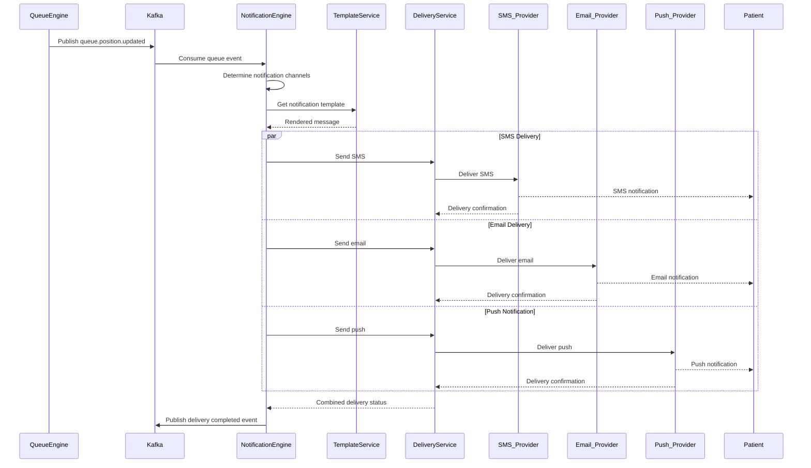
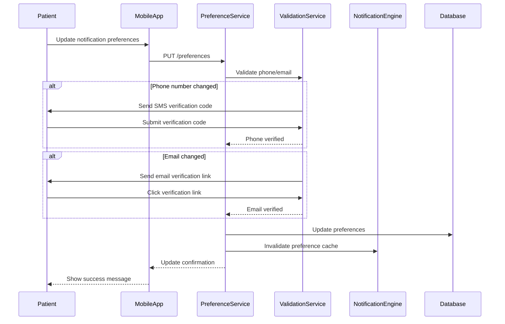

# Communication & Notifications - Technical Design

## Architecture Overview

### Communication Service Architecture
```
┌─────────────────────────────────────────────────────────────┐
│                 Notification Gateway                        │
│              (Message Routing & Delivery)                   │
└─────────────────────┬───────────────────────────────────────┘
                      │
┌─────────────────────┼───────────────────────────────────────┐
│     Event Bus       │    Notification Engine                │
│   (Apache Kafka)    │                                       │
│                     │  ┌─────────────┬─────────────────────┐ │
│ • Queue Events      │  │   Message   │    Delivery         │ │
│ • Wait Time Updates │  │ Composer    │   Scheduler         │ │
│ • System Alerts     │  │             │                     │ │
│                     │  └─────────────┴─────────────────────┘ │
└─────────────────────┼───────────────────────────────────────┘
                      │
┌─────────────────────┼───────────────────────────────────────┐
│   External Services │           Data Layer                  │
│                     │                                       │
│ • Twilio (SMS)      │ • Patient Preferences                │
│ • SendGrid (Email)  │ • Notification History               │
│ • Firebase (Push)   │ • Delivery Tracking                  │
│ • Backup Services   │ • Template Management                │
└─────────────────────┴───────────────────────────────────────┘
```

## Data Models

### Notification Preference
```typescript
interface NotificationPreference {
  id: string;
  patientId: string;
  channels: {
    sms: {
      enabled: boolean;
      phoneNumber: string;
      verified: boolean;
      verifiedAt?: Date;
    };
    email: {
      enabled: boolean;
      emailAddress: string;
      verified: boolean;
      verifiedAt?: Date;
    };
    push: {
      enabled: boolean;
      deviceTokens: string[];
      platform: ('ios' | 'android')[];
    };
  };
  timing: {
    advanceNoticeMinutes: number; // How early to notify before appointment
    quietHours: {
      enabled: boolean;
      startTime: string; // HH:MM format
      endTime: string;   // HH:MM format
      timezone: string;
    };
    urgentOnly: boolean; // Only send urgent notifications
  };
  frequency: 'all' | 'important' | 'urgent_only';
  language: string;
  accessibility: {
    largeText: boolean;
    simpleLanguage: boolean;
    audioDescriptions: boolean;
  };
  createdAt: Date;
  updatedAt: Date;
}
```

### Notification Template
```typescript
interface NotificationTemplate {
  id: string;
  type: 'queue_joined' | 'position_update' | 'almost_ready' | 'your_turn' | 'delay_alert' | 'appointment_reminder';
  channel: 'sms' | 'email' | 'push';
  language: string;
  priority: 'low' | 'normal' | 'high' | 'urgent';
  content: {
    subject?: string; // For email
    title?: string;   // For push notifications
    body: string;     // Template with placeholders
    actionButtons?: Array<{
      text: string;
      action: string;
      url?: string;
    }>;
  };
  variables: string[]; // Available template variables
  accessibility: {
    screenReaderText?: string;
    highContrastVersion?: string;
  };
  metadata: {
    estimatedLength: number;
    characterCount: number;
    readingLevel: number;
  };
  isActive: boolean;
  createdAt: Date;
  updatedAt: Date;
}
```

### Notification Event
```typescript
interface NotificationEvent {
  id: string;
  patientId: string;
  facilityId: string;
  queueId?: string;
  type: string;
  priority: 'low' | 'normal' | 'high' | 'urgent';
  scheduledFor: Date;
  channels: ('sms' | 'email' | 'push')[];
  templateData: Record<string, any>;
  status: 'pending' | 'processing' | 'sent' | 'failed' | 'cancelled';
  attempts: number;
  maxAttempts: number;
  delivery: {
    sms?: NotificationDelivery;
    email?: NotificationDelivery;
    push?: NotificationDelivery;
  };
  createdAt: Date;
  processedAt?: Date;
  completedAt?: Date;
}

interface NotificationDelivery {
  status: 'pending' | 'sent' | 'delivered' | 'failed' | 'bounced';
  sentAt?: Date;
  deliveredAt?: Date;
  errorCode?: string;
  errorMessage?: string;
  provider: string;
  providerMessageId?: string;
  attempts: number;
}
```

## Service Implementation

### Notification Engine
```typescript
export class NotificationEngine {
  constructor(
    private templateService: TemplateService,
    private deliveryService: DeliveryService,
    private preferenceService: PreferenceService,
    private eventPublisher: EventPublisher
  ) {}

  async processNotificationEvent(event: NotificationEvent): Promise<void> {
    try {
      // Get patient preferences
      const preferences = await this.preferenceService.getPreferences(event.patientId);
      
      if (!this.shouldSendNotification(event, preferences)) {
        await this.markEventCancelled(event.id, 'Patient preferences exclude this notification');
        return;
      }

      // Determine delivery channels based on preferences and event priority
      const channels = this.selectDeliveryChannels(event, preferences);
      
      if (channels.length === 0) {
        await this.markEventCancelled(event.id, 'No valid delivery channels');
        return;
      }

      // Update event status
      await this.updateEventStatus(event.id, 'processing');

      // Process each channel
      const deliveryPromises = channels.map(channel => 
        this.processChannelDelivery(event, channel, preferences)
      );

      const results = await Promise.allSettled(deliveryPromises);
      
      // Update event with delivery results
      await this.updateEventDeliveryResults(event.id, results);

      // Publish delivery completed event
      await this.eventPublisher.publish('notification.processed', {
        eventId: event.id,
        patientId: event.patientId,
        deliveryResults: results
      });

    } catch (error) {
      console.error(`Failed to process notification event ${event.id}:`, error);
      await this.handleNotificationError(event, error);
    }
  }

  private async processChannelDelivery(
    event: NotificationEvent,
    channel: 'sms' | 'email' | 'push',
    preferences: NotificationPreference
  ): Promise<NotificationDelivery> {
    const template = await this.templateService.getTemplate(
      event.type,
      channel,
      preferences.language
    );

    const message = await this.templateService.renderTemplate(template, {
      ...event.templateData,
      patientName: await this.getPatientName(event.patientId),
      facilityName: await this.getFacilityName(event.facilityId)
    });

    // Apply accessibility modifications if needed
    if (preferences.accessibility.simpleLanguage) {
      message.content = await this.simplifyLanguage(message.content);
    }

    if (preferences.accessibility.largeText && channel === 'email') {
      message.content = this.applyLargeTextFormatting(message.content);
    }

    // Deliver message
    const delivery = await this.deliveryService.deliver(channel, {
      recipient: this.getRecipientInfo(preferences, channel),
      message,
      priority: event.priority,
      metadata: {
        eventId: event.id,
        patientId: event.patientId
      }
    });

    return delivery;
  }

  private selectDeliveryChannels(
    event: NotificationEvent,
    preferences: NotificationPreference
  ): ('sms' | 'email' | 'push')[] {
    const channels: ('sms' | 'email' | 'push')[] = [];

    // For urgent notifications, use all available channels
    if (event.priority === 'urgent') {
      if (preferences.channels.sms.enabled && preferences.channels.sms.verified) {
        channels.push('sms');
      }
      if (preferences.channels.email.enabled && preferences.channels.email.verified) {
        channels.push('email');
      }
      if (preferences.channels.push.enabled && preferences.channels.push.deviceTokens.length > 0) {
        channels.push('push');
      }
      return channels;
    }

    // For non-urgent, respect frequency preferences
    switch (preferences.frequency) {
      case 'urgent_only':
        // Only send if urgent
        break;
      case 'important':
        if (event.priority === 'high' || event.priority === 'urgent') {
          channels.push(...this.getPreferredChannels(preferences));
        }
        break;
      case 'all':
        channels.push(...this.getPreferredChannels(preferences));
        break;
    }

    return channels;
  }
}
```

### Message Delivery Service
```typescript
export class MessageDeliveryService {
  constructor(
    private smsService: SMSService,
    private emailService: EmailService,
    private pushService: PushNotificationService,
    private retryService: RetryService
  ) {}

  async deliver(
    channel: 'sms' | 'email' | 'push',
    deliveryRequest: DeliveryRequest
  ): Promise<NotificationDelivery> {
    const delivery: NotificationDelivery = {
      status: 'pending',
      provider: this.getProviderName(channel),
      attempts: 1
    };

    try {
      const result = await this.executeDelivery(channel, deliveryRequest);
      
      delivery.status = 'sent';
      delivery.sentAt = new Date();
      delivery.providerMessageId = result.messageId;

      // Schedule delivery confirmation check
      await this.scheduleDeliveryConfirmation(delivery, deliveryRequest.metadata.eventId);

      return delivery;

    } catch (error) {
      delivery.status = 'failed';
      delivery.errorCode = error.code;
      delivery.errorMessage = error.message;

      // Schedule retry if appropriate
      if (this.shouldRetry(error, delivery.attempts)) {
        await this.retryService.scheduleRetry(deliveryRequest, delivery.attempts + 1);
      }

      return delivery;
    }
  }

  private async executeDelivery(
    channel: 'sms' | 'email' | 'push',
    request: DeliveryRequest
  ): Promise<DeliveryResult> {
    switch (channel) {
      case 'sms':
        return await this.smsService.send({
          to: request.recipient.phone,
          message: request.message.content,
          priority: request.priority
        });

      case 'email':
        return await this.emailService.send({
          to: request.recipient.email,
          subject: request.message.subject,
          html: request.message.content,
          priority: request.priority
        });

      case 'push':
        return await this.pushService.send({
          tokens: request.recipient.deviceTokens,
          title: request.message.title,
          body: request.message.content,
          data: request.metadata,
          priority: request.priority
        });

      default:
        throw new Error(`Unsupported delivery channel: ${channel}`);
    }
  }

  async confirmDelivery(
    deliveryId: string,
    providerStatus: string
  ): Promise<void> {
    const delivery = await this.getDelivery(deliveryId);
    
    const statusMapping = {
      'delivered': 'delivered',
      'failed': 'failed',
      'bounced': 'bounced',
      'undelivered': 'failed'
    };

    delivery.status = statusMapping[providerStatus] || 'failed';
    delivery.deliveredAt = delivery.status === 'delivered' ? new Date() : undefined;

    await this.updateDelivery(delivery);

    // Trigger fallback delivery if primary failed
    if (delivery.status === 'failed' || delivery.status === 'bounced') {
      await this.triggerFallbackDelivery(delivery);
    }
  }
}
```

### Template Management Service
```typescript
export class TemplateService {
  constructor(
    private templateRepository: TemplateRepository,
    private i18nService: I18nService
  ) {}

  async renderTemplate(
    template: NotificationTemplate,
    data: Record<string, any>
  ): Promise<RenderedMessage> {
    let content = template.content.body;
    
    // Replace template variables
    Object.entries(data).forEach(([key, value]) => {
      const placeholder = `{{${key}}}`;
      content = content.replace(new RegExp(placeholder, 'g'), String(value));
    });

    // Apply personalization
    content = await this.personalizeContent(content, data);

    // Validate message length constraints
    this.validateMessageConstraints(template.channel, content);

    return {
      subject: template.content.subject ? 
        this.renderString(template.content.subject, data) : undefined,
      title: template.content.title ? 
        this.renderString(template.content.title, data) : undefined,
      content,
      actionButtons: template.content.actionButtons?.map(button => ({
        ...button,
        text: this.renderString(button.text, data),
        url: button.url ? this.renderString(button.url, data) : undefined
      }))
    };
  }

  private async personalizeContent(content: string, data: Record<string, any>): Promise<string> {
    // Add greeting based on time of day
    const hour = new Date().getHours();
    let greeting = 'Hello';
    
    if (hour < 12) greeting = 'Good morning';
    else if (hour < 18) greeting = 'Good afternoon';
    else greeting = 'Good evening';

    content = content.replace('{{greeting}}', greeting);

    // Add facility-specific information
    if (data.facilityId) {
      const facilityInfo = await this.getFacilityInfo(data.facilityId);
      content = content.replace('{{facilityPhone}}', facilityInfo.phone);
      content = content.replace('{{facilityAddress}}', facilityInfo.address);
    }

    return content;
  }

  private validateMessageConstraints(channel: string, content: string): void {
    const constraints = {
      sms: { maxLength: 160, recommended: 140 },
      email: { maxLength: 10000, recommended: 500 },
      push: { maxLength: 178, recommended: 50 } // iOS limit
    };

    const constraint = constraints[channel];
    if (!constraint) return;

    if (content.length > constraint.maxLength) {
      throw new Error(`Message too long for ${channel}: ${content.length} > ${constraint.maxLength}`);
    }

    if (content.length > constraint.recommended) {
      console.warn(`Message longer than recommended for ${channel}: ${content.length} > ${constraint.recommended}`);
    }
  }
}
```

### Multi-Channel Delivery Service
```typescript
export class MultiChannelDeliveryService {
  constructor(
    private smsProvider: TwilioService,
    private emailProvider: SendGridService,
    private pushProvider: FirebaseService,
    private backupProviders: Map<string, any>
  ) {}

  async sendSMS(request: SMSRequest): Promise<DeliveryResult> {
    try {
      const result = await this.smsProvider.send({
        to: request.to,
        body: request.message,
        from: process.env.TWILIO_PHONE_NUMBER
      });

      return {
        success: true,
        messageId: result.sid,
        provider: 'twilio',
        sentAt: new Date()
      };

    } catch (error) {
      console.error('Primary SMS delivery failed:', error);
      
      // Try backup SMS provider
      const backupSMS = this.backupProviders.get('sms');
      if (backupSMS) {
        return await this.sendSMSBackup(request, backupSMS);
      }

      throw error;
    }
  }

  async sendEmail(request: EmailRequest): Promise<DeliveryResult> {
    try {
      const result = await this.emailProvider.send({
        to: request.to,
        from: process.env.FROM_EMAIL,
        subject: request.subject,
        html: request.html,
        text: request.text
      });

      return {
        success: true,
        messageId: result.messageId,
        provider: 'sendgrid',
        sentAt: new Date()
      };

    } catch (error) {
      console.error('Primary email delivery failed:', error);
      
      // Try backup email provider
      const backupEmail = this.backupProviders.get('email');
      if (backupEmail) {
        return await this.sendEmailBackup(request, backupEmail);
      }

      throw error;
    }
  }

  async sendPushNotification(request: PushRequest): Promise<DeliveryResult> {
    const results: DeliveryResult[] = [];

    // Send to all device tokens
    for (const token of request.tokens) {
      try {
        const result = await this.pushProvider.send({
          token,
          notification: {
            title: request.title,
            body: request.body
          },
          data: request.data,
          android: {
            priority: 'high',
            notification: {
              channelId: 'queue_updates',
              sound: 'default'
            }
          },
          apns: {
            payload: {
              aps: {
                alert: {
                  title: request.title,
                  body: request.body
                },
                sound: 'default',
                badge: 1
              }
            }
          }
        });

        results.push({
          success: true,
          messageId: result.messageId,
          provider: 'firebase',
          sentAt: new Date(),
          deviceToken: token
        });

      } catch (error) {
        results.push({
          success: false,
          error: error.message,
          provider: 'firebase',
          sentAt: new Date(),
          deviceToken: token
        });

        // Remove invalid tokens
        if (error.code === 'messaging/invalid-registration-token') {
          await this.removeInvalidDeviceToken(token);
        }
      }
    }

    // Return combined results
    const successCount = results.filter(r => r.success).length;
    return {
      success: successCount > 0,
      messageId: `batch-${Date.now()}`,
      provider: 'firebase',
      sentAt: new Date(),
      batchResults: results,
      successCount,
      totalCount: results.length
    };
  }
}
```

### Smart Scheduling Service
```typescript
export class NotificationScheduler {
  constructor(
    private bull: Bull.Queue,
    private preferenceService: PreferenceService
  ) {}

  async scheduleNotification(
    event: NotificationEvent,
    preferences: NotificationPreference
  ): Promise<void> {
    const scheduledTime = this.calculateOptimalDeliveryTime(event, preferences);
    
    // Check for quiet hours
    if (this.isInQuietHours(scheduledTime, preferences.timing.quietHours)) {
      if (event.priority === 'urgent') {
        // Send urgent notifications even during quiet hours
        console.log(`Sending urgent notification during quiet hours for patient ${event.patientId}`);
      } else {
        // Delay until quiet hours end
        scheduledTime = this.getNextAllowedTime(preferences.timing.quietHours);
      }
    }

    const delay = Math.max(0, scheduledTime.getTime() - Date.now());

    await this.bull.add('process-notification', event, {
      delay,
      attempts: 3,
      backoff: {
        type: 'exponential',
        settings: {
          multiplier: 2,
          maxDelay: 300000 // 5 minutes max delay
        }
      },
      removeOnComplete: 100, // Keep last 100 completed jobs
      removeOnFail: 50       // Keep last 50 failed jobs for debugging
    });
  }

  private calculateOptimalDeliveryTime(
    event: NotificationEvent,
    preferences: NotificationPreference
  ): Date {
    let deliveryTime = new Date(event.scheduledFor);

    // For position updates, add patient's preferred advance notice
    if (event.type === 'almost_ready' || event.type === 'your_turn') {
      const advanceMinutes = preferences.timing.advanceNoticeMinutes;
      deliveryTime = new Date(deliveryTime.getTime() - advanceMinutes * 60000);
    }

    // Ensure we don't schedule in the past
    if (deliveryTime.getTime() < Date.now()) {
      deliveryTime = new Date(Date.now() + 1000); // 1 second from now
    }

    return deliveryTime;
  }

  private isInQuietHours(time: Date, quietHours: any): boolean {
    if (!quietHours.enabled) return false;

    const timeStr = time.toLocaleTimeString('en-US', { 
      hour12: false, 
      hour: '2-digit', 
      minute: '2-digit',
      timeZone: quietHours.timezone 
    });

    return timeStr >= quietHours.startTime && timeStr <= quietHours.endTime;
  }
}
```

## Real-Time Communication

### WebSocket Notification Delivery
```typescript
export class WebSocketNotificationService {
  constructor(private io: Server) {}

  async sendRealTimeNotification(
    patientId: string,
    notification: RealTimeNotification
  ): Promise<void> {
    const room = `patient:${patientId}`;
    
    // Send to patient's connected devices
    this.io.to(room).emit('notification', {
      id: notification.id,
      type: notification.type,
      title: notification.title,
      message: notification.message,
      data: notification.data,
      timestamp: new Date().toISOString(),
      priority: notification.priority
    });

    // Track delivery attempt
    await this.trackWebSocketDelivery(patientId, notification.id);
  }

  async sendToStaff(
    facilityId: string,
    notification: StaffNotification
  ): Promise<void> {
    const staffRoom = `staff:${facilityId}`;
    
    this.io.to(staffRoom).emit('staff-notification', {
      id: notification.id,
      type: notification.type,
      message: notification.message,
      data: notification.data,
      priority: notification.priority,
      requiresAction: notification.requiresAction
    });
  }

  handleClientAcknowledgment(
    socket: Socket,
    acknowledgment: NotificationAcknowledgment
  ): void {
    console.log(`Client ${socket.id} acknowledged notification ${acknowledgment.notificationId}`);
    
    // Update delivery status
    this.updateWebSocketDeliveryStatus(
      acknowledgment.notificationId,
      'acknowledged',
      socket.userId
    );

    // Process any required actions
    if (acknowledgment.action) {
      this.processNotificationAction(acknowledgment);
    }
  }
}
```

### Event-Driven Notification Triggers
```typescript
export class NotificationEventHandler {
  constructor(
    private notificationEngine: NotificationEngine,
    private kafka: Kafka
  ) {
    this.setupKafkaConsumers();
  }

  private async setupKafkaConsumers(): Promise<void> {
    const consumer = this.kafka.consumer({ groupId: 'notification-handlers' });
    
    await consumer.subscribe({
      topics: ['queue-updates', 'appointment-events', 'system-alerts']
    });

    await consumer.run({
      eachMessage: async ({ topic, partition, message }) => {
        const event = JSON.parse(message.value!.toString());
        
        try {
          await this.handleEvent(topic, event);
        } catch (error) {
          console.error(`Failed to process notification event:`, error);
          // Send to dead letter queue for manual processing
          await this.sendToDeadLetterQueue(topic, message, error);
        }
      }
    });
  }

  private async handleEvent(topic: string, event: any): Promise<void> {
    switch (topic) {
      case 'queue-updates':
        await this.handleQueueUpdate(event);
        break;
      case 'appointment-events':
        await this.handleAppointmentEvent(event);
        break;
      case 'system-alerts':
        await this.handleSystemAlert(event);
        break;
    }
  }

  private async handleQueueUpdate(event: QueueUpdateEvent): Promise<void> {
    switch (event.eventType) {
      case 'queue.position.updated':
        await this.handlePositionUpdate(event);
        break;
      case 'queue.waittime.updated':
        await this.handleWaitTimeUpdate(event);
        break;
      case 'queue.patient.called':
        await this.handlePatientCalled(event);
        break;
    }
  }

  private async handlePositionUpdate(event: any): Promise<void> {
    const { patientId, newPosition, oldPosition, estimatedWait } = event;
    
    // Only notify if position improved significantly or patient is almost ready
    if (newPosition < oldPosition - 2 || newPosition <= 3) {
      const notificationEvent: NotificationEvent = {
        id: `pos-update-${Date.now()}-${patientId}`,
        patientId,
        facilityId: event.facilityId,
        queueId: event.queueId,
        type: newPosition <= 3 ? 'almost_ready' : 'position_update',
        priority: newPosition === 1 ? 'urgent' : 'normal',
        scheduledFor: new Date(),
        channels: ['push', 'sms'],
        templateData: {
          position: newPosition,
          estimatedWait,
          previousPosition: oldPosition
        },
        status: 'pending',
        attempts: 0,
        maxAttempts: 3,
        createdAt: new Date()
      };

      await this.notificationEngine.processNotificationEvent(notificationEvent);
    }
  }

  private async handleWaitTimeUpdate(event: any): Promise<void> {
    const { affectedPatients } = event;
    
    for (const patient of affectedPatients) {
      const timeDifference = patient.newEstimate - patient.oldEstimate;
      
      // Only notify for significant delays (>20 minutes increase)
      if (timeDifference > 20) {
        const notificationEvent: NotificationEvent = {
          id: `delay-${Date.now()}-${patient.patientId}`,
          patientId: patient.patientId,
          facilityId: event.facilityId,
          queueId: event.queueId,
          type: 'delay_alert',
          priority: timeDifference > 60 ? 'high' : 'normal',
          scheduledFor: new Date(),
          channels: ['sms', 'email', 'push'],
          templateData: {
            delayMinutes: timeDifference,
            newEstimate: patient.newEstimate,
            oldEstimate: patient.oldEstimate
          },
          status: 'pending',
          attempts: 0,
          maxAttempts: 3,
          createdAt: new Date()
        };

        await this.notificationEngine.processNotificationEvent(notificationEvent);
      }
    }
  }
}
```

## Sequence Diagrams

### Multi-Channel Notification Flow


### Notification Preference Update Flow


## Implementation Considerations

### Multi-Language Support
```typescript
export class I18nNotificationService {
  private translations = new Map<string, Record<string, string>>();
  
  constructor() {
    this.loadTranslations();
  }

  async getLocalizedTemplate(
    templateType: string,
    channel: string,
    language: string
  ): Promise<NotificationTemplate> {
    const template = await this.templateRepository.findByTypeAndChannel(
      templateType, 
      channel, 
      language
    );

    if (!template) {
      // Fallback to English if translation not available
      console.warn(`Template not found for ${templateType}/${channel}/${language}, using English`);
      return await this.templateRepository.findByTypeAndChannel(templateType, channel, 'en');
    }

    return template;
  }

  translateContent(content: string, language: string, variables: Record<string, any>): string {
    const translations = this.translations.get(language) || this.translations.get('en');
    
    // Replace translation keys
    let translatedContent = content.replace(/\{\{t:([^}]+)\}\}/g, (match, key) => {
      return translations?.[key] || key;
    });

    // Replace variables
    Object.entries(variables).forEach(([key, value]) => {
      translatedContent = translatedContent.replace(
        new RegExp(`\\{\\{${key}\\}\\}`, 'g'), 
        String(value)
      );
    });

    return translatedContent;
  }

  async detectPatientLanguage(patientId: string): Promise<string> {
    const preferences = await this.preferenceService.getPreferences(patientId);
    
    if (preferences?.language) {
      return preferences.language;
    }

    // Fallback to facility default or system default
    const facility = await this.getFacilityForPatient(patientId);
    return facility?.defaultLanguage || 'en';
  }
}
```

### Accessibility Features
```typescript
export class AccessibilityNotificationService {
  async adaptNotificationForAccessibility(
    message: RenderedMessage,
    accessibilityNeeds: AccessibilitySettings
  ): Promise<RenderedMessage> {
    let adaptedMessage = { ...message };

    if (accessibilityNeeds.simpleLanguage) {
      adaptedMessage.content = await this.simplifyLanguage(adaptedMessage.content);
    }

    if (accessibilityNeeds.largeText) {
      adaptedMessage.content = this.applyLargeTextFormatting(adaptedMessage.content);
    }

    if (accessibilityNeeds.audioDescriptions) {
      adaptedMessage.audioDescription = await this.generateAudioDescription(adaptedMessage.content);
    }

    return adaptedMessage;
  }

  private async simplifyLanguage(content: string): Promise<string> {
    // Use AI/NLP service to simplify language
    const simplificationRules = [
      { from: /approximately/gi, to: 'about' },
      { from: /currently/gi, to: 'now' },
      { from: /immediately/gi, to: 'right away' },
      { from: /estimated wait time/gi, to: 'wait time' },
      { from: /appointment scheduled/gi, to: 'appointment' }
    ];

    let simplifiedContent = content;
    simplificationRules.forEach(rule => {
      simplifiedContent = simplifiedContent.replace(rule.from, rule.to);
    });

    // Break long sentences into shorter ones
    simplifiedContent = simplifiedContent.replace(/(\. )([A-Z])/g, '.\n\n$2');

    return simplifiedContent;
  }

  private applyLargeTextFormatting(content: string): string {
    // Add HTML styling for large text (email notifications)
    return `
      <div style="font-size: 18px; line-height: 1.6; font-family: Arial, sans-serif;">
        ${content.replace(/\n/g, '<br>')}
      </div>
    `;
  }

  private async generateAudioDescription(content: string): Promise<string> {
    // Generate SSML (Speech Synthesis Markup Language) for text-to-speech
    const ssml = `
      <speak>
        <prosody rate="medium" pitch="medium">
          ${content}
        </prosody>
      </speak>
    `;

    return ssml;
  }
}
```

### Error Handling and Retry Logic
```typescript
export class NotificationRetryService {
  constructor(private bull: Bull.Queue) {}

  async handleFailedNotification(
    event: NotificationEvent,
    error: Error,
    attempt: number
  ): Promise<void> {
    const shouldRetry = this.shouldRetryNotification(error, attempt, event.maxAttempts);
    
    if (!shouldRetry) {
      await this.handlePermanentFailure(event, error);
      return;
    }

    // Calculate retry delay with exponential backoff
    const delay = this.calculateRetryDelay(attempt);
    
    // Update event for retry
    const retryEvent = {
      ...event,
      attempts: attempt + 1,
      status: 'pending' as const
    };

    await this.bull.add('process-notification-retry', retryEvent, {
      delay,
      attempts: 1, // Don't let Bull retry, we handle it ourselves
      removeOnComplete: 10,
      removeOnFail: 50
    });

    console.log(`Scheduled retry ${attempt + 1} for notification ${event.id} with delay ${delay}ms`);
  }

  private shouldRetryNotification(error: Error, attempt: number, maxAttempts: number): boolean {
    if (attempt >= maxAttempts) {
      return false;
    }

    // Don't retry for certain error types
    const nonRetryableErrors = [
      'INVALID_PHONE_NUMBER',
      'INVALID_EMAIL_ADDRESS',
      'UNSUBSCRIBED',
      'BLOCKED_RECIPIENT'
    ];

    return !nonRetryableErrors.includes(error.message);
  }

  private calculateRetryDelay(attempt: number): number {
    // Exponential backoff with jitter
    const baseDelay = 1000; // 1 second
    const exponentialDelay = Math.pow(2, attempt - 1) * baseDelay;
    const jitter = Math.random() * 0.1 * exponentialDelay;
    
    return Math.min(exponentialDelay + jitter, 300000); // Max 5 minutes
  }

  private async handlePermanentFailure(event: NotificationEvent, error: Error): Promise<void> {
    console.error(`Permanent failure for notification ${event.id}:`, error);

    // Try alternative delivery methods
    await this.tryAlternativeDelivery(event);

    // Log for manual follow-up
    await this.logFailedNotification(event, error);

    // Notify administrators if it's a critical notification
    if (event.priority === 'urgent') {
      await this.notifyAdministrators(event, error);
    }
  }

  private async tryAlternativeDelivery(event: NotificationEvent): Promise<void> {
    const preferences = await this.preferenceService.getPreferences(event.patientId);
    
    // If SMS failed, try email
    if (event.channels.includes('sms') && !event.channels.includes('email')) {
      if (preferences.channels.email.enabled && preferences.channels.email.verified) {
        const emailEvent = {
          ...event,
          id: `${event.id}-email-fallback`,
          channels: ['email' as const],
          attempts: 0
        };
        
        await this.notificationEngine.processNotificationEvent(emailEvent);
      }
    }
    
    // If automated delivery failed, create manual task for staff
    await this.createManualFollowupTask(event);
  }
}
```

### Performance Optimization
```typescript
export class NotificationCache {
  constructor(private redis: Redis) {}

  async cachePatientPreferences(patientId: string, preferences: NotificationPreference): Promise<void> {
    const key = `preferences:${patientId}`;
    await this.redis.setex(key, 3600, JSON.stringify(preferences)); // 1 hour TTL
  }

  async getCachedPreferences(patientId: string): Promise<NotificationPreference | null> {
    const cached = await this.redis.get(`preferences:${patientId}`);
    return cached ? JSON.parse(cached) : null;
  }

  async cacheTemplate(templateKey: string, template: NotificationTemplate): Promise<void> {
    const key = `template:${templateKey}`;
    await this.redis.setex(key, 7200, JSON.stringify(template)); // 2 hours TTL
  }

  async batchCacheTemplates(templates: Array<{ key: string; template: NotificationTemplate }>): Promise<void> {
    const pipeline = this.redis.pipeline();
    
    templates.forEach(({ key, template }) => {
      pipeline.setex(`template:${key}`, 7200, JSON.stringify(template));
    });
    
    await pipeline.exec();
  }

  async invalidatePatientCache(patientId: string): Promise<void> {
    await this.redis.del(`preferences:${patientId}`);
  }
}
```

### Delivery Confirmation Tracking
```typescript
export class DeliveryTrackingService {
  constructor(
    private webhookService: WebhookService,
    private database: Database
  ) {}

  async setupDeliveryTracking(): Promise<void> {
    // Setup webhooks for delivery confirmations
    await this.webhookService.register('/webhooks/sms-delivery', this.handleSMSDelivery.bind(this));
    await this.webhookService.register('/webhooks/email-delivery', this.handleEmailDelivery.bind(this));
    await this.webhookService.register('/webhooks/push-delivery', this.handlePushDelivery.bind(this));
  }

  async handleSMSDelivery(payload: TwilioDeliveryWebhook): Promise<void> {
    const { MessageSid, MessageStatus, To } = payload;
    
    await this.updateDeliveryStatus({
      providerMessageId: MessageSid,
      status: this.mapTwilioStatus(MessageStatus),
      deliveredAt: MessageStatus === 'delivered' ? new Date() : undefined,
      recipient: To
    });
  }

  async handleEmailDelivery(payload: SendGridDeliveryWebhook): Promise<void> {
    const event = payload[0]; // SendGrid sends arrays
    
    await this.updateDeliveryStatus({
      providerMessageId: event.sg_message_id,
      status: this.mapSendGridStatus(event.event),
      deliveredAt: event.event === 'delivered' ? new Date(event.timestamp * 1000) : undefined,
      recipient: event.email
    });
  }

  async generateDeliveryReport(
    facilityId: string,
    startDate: Date,
    endDate: Date
  ): Promise<DeliveryReport> {
    const deliveryStats = await this.database.query(`
      SELECT 
        channel,
        status,
        COUNT(*) as count,
        AVG(EXTRACT(EPOCH FROM delivered_at - sent_at)) as avg_delivery_time
      FROM notification_deliveries 
      WHERE facility_id = ? 
        AND created_at BETWEEN ? AND ?
      GROUP BY channel, status
    `, [facilityId, startDate, endDate]);

    return {
      facilityId,
      period: { startDate, endDate },
      totalNotifications: deliveryStats.reduce((sum, stat) => sum + stat.count, 0),
      deliveryStats: this.processDeliveryStats(deliveryStats),
      recommendations: this.generateRecommendations(deliveryStats)
    };
  }

  private mapTwilioStatus(status: string): string {
    const mapping = {
      'queued': 'pending',
      'sent': 'sent', 
      'delivered': 'delivered',
      'failed': 'failed',
      'undelivered': 'failed'
    };
    return mapping[status] || 'unknown';
  }

  private mapSendGridStatus(event: string): string {
    const mapping = {
      'processed': 'sent',
      'delivered': 'delivered',
      'bounce': 'bounced',
      'blocked': 'failed',
      'dropped': 'failed'
    };
    return mapping[event] || 'unknown';
  }
}
```