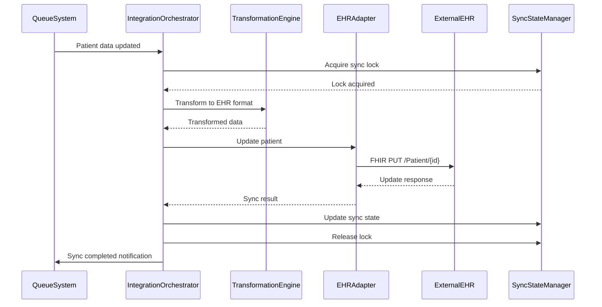
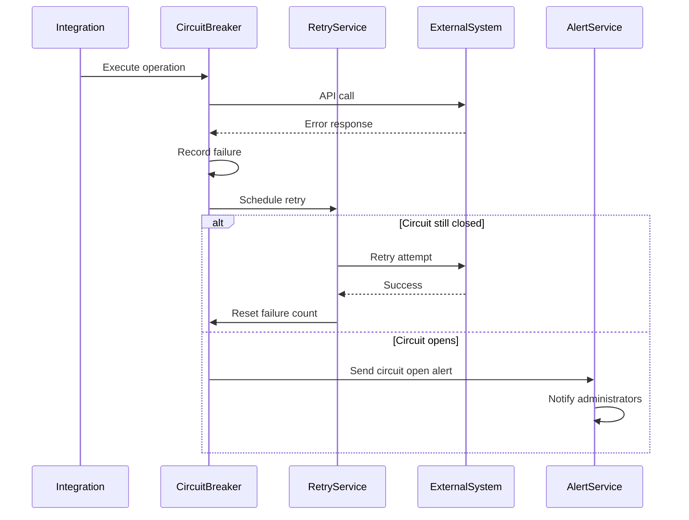

# Integration Capabilities - Technical Design

## Architecture Overview

### Integration Platform Architecture
```
┌─────────────────────────────────────────────────────────────┐
│                 Integration Management Layer                │
│                    (API Gateway + ESB)                      │
├─────────────────┬─────────────────┬─────────────────────────┤
│   API Gateway   │  Data Transform │   Workflow Engine      │
│                 │                 │                         │
│ • Rate Limiting │ • Field Mapping │ • Integration Flows    │
│ • Auth/AuthZ    │ • Validation    │ • Error Handling       │
│ • Load Balancing│ • Normalization │ • Retry Logic          │
│ • Monitoring    │ • Enrichment    │ • Circuit Breakers     │
└─────────────────┴─────────────────┴─────────────────────────┘
                              │
┌─────────────────────────────────────────────────────────────┐
│                    Message Queue Layer                      │
│              (Apache Kafka + Dead Letter Queues)           │
└─────────────────────────────────────────────────────────────┘
                              │
┌─────────────────┬─────────────────┬─────────────────────────┤
│  EHR Adapters   │  PMS Adapters   │   Other Integrations    │
│                 │                 │                         │
│ • Epic FHIR     │ • Billing APIs  │ • LIS Integration      │
│ • Cerner APIs   │ • Insurance     │ • Pharmacy Systems     │
│ • Allscripts    │ • Payment Proc  │ • Facility Management  │
│ • Custom HL7    │ • Scheduling    │ • Communication APIs   │
└─────────────────┴─────────────────┴─────────────────────────┘
```

## Data Models

### Integration Configuration
```typescript
interface IntegrationConfiguration {
  id: string;
  facilityId: string;
  systemType: 'ehr' | 'pms' | 'lis' | 'pharmacy' | 'facility_mgmt' | 'custom';
  systemName: string;
  vendor: string;
  version: string;
  connection: {
    type: 'rest' | 'soap' | 'fhir' | 'hl7' | 'file' | 'database';
    endpoint: string;
    authentication: {
      type: 'oauth2' | 'basic' | 'api_key' | 'certificate' | 'custom';
      credentials: EncryptedCredentials;
      refreshConfig?: {
        refreshUrl: string;
        refreshInterval: number;
      };
    };
    timeout: number;
    retryPolicy: {
      maxAttempts: number;
      backoffStrategy: 'linear' | 'exponential';
      backoffBase: number;
    };
  };
  dataMapping: {
    inbound: FieldMapping[];
    outbound: FieldMapping[];
    transformationRules: TransformationRule[];
  };
  synchronization: {
    enabled: boolean;
    direction: 'inbound' | 'outbound' | 'bidirectional';
    frequency: 'real_time' | 'scheduled' | 'on_demand';
    scheduleConfig?: {
      cronExpression: string;
      timezone: string;
    };
    conflictResolution: 'manual' | 'timestamp_wins' | 'source_priority';
  };
  monitoring: {
    healthCheckInterval: number;
    alertThresholds: {
      responseTime: number;
      errorRate: number;
      dataQuality: number;
    };
  };
  isActive: boolean;
  lastHealthCheck?: Date;
  createdAt: Date;
  updatedAt: Date;
}

interface FieldMapping {
  sourceField: string;
  targetField: string;
  dataType: string;
  isRequired: boolean;
  defaultValue?: any;
  validationRules?: ValidationRule[];
  transformFunction?: string;
}

interface TransformationRule {
  id: string;
  name: string;
  condition: string; // JavaScript expression
  action: 'map' | 'calculate' | 'lookup' | 'validate' | 'enrich';
  parameters: Record<string, any>;
  order: number;
}
```

### Integration Event
```typescript
interface IntegrationEvent {
  id: string;
  integrationId: string;
  eventType: 'sync_request' | 'sync_response' | 'error' | 'health_check';
  direction: 'inbound' | 'outbound';
  entityType: 'patient' | 'appointment' | 'provider' | 'facility';
  entityId: string;
  payload: {
    original: any;
    transformed?: any;
    errors?: ValidationError[];
  };
  metadata: {
    source: string;
    correlationId: string;
    parentEventId?: string;
    attemptNumber: number;
    processingTime?: number;
  };
  status: 'pending' | 'processing' | 'completed' | 'failed' | 'retrying';
  timestamps: {
    created: Date;
    started?: Date;
    completed?: Date;
    lastRetry?: Date;
  };
  result?: {
    success: boolean;
    message?: string;
    externalId?: string;
    warnings?: string[];
  };
}
```

### Sync State Management
```typescript
interface SyncState {
  integrationId: string;
  entityType: string;
  entityId: string;
  localVersion: string;
  externalVersion: string;
  lastSyncTime: Date;
  syncStatus: 'in_sync' | 'out_of_sync' | 'conflict' | 'error';
  conflictDetails?: {
    conflictedFields: string[];
    localData: any;
    externalData: any;
    detectedAt: Date;
  };
  retryCount: number;
  nextRetryTime?: Date;
  locks: {
    isLocked: boolean;
    lockedBy?: string;
    lockedAt?: Date;
    lockExpires?: Date;
  };
}
```

## Service Implementation

### Integration Orchestrator
```typescript
export class IntegrationOrchestrator {
  constructor(
    private configService: IntegrationConfigService,
    private adapterFactory: AdapterFactory,
    private transformationEngine: TransformationEngine,
    private syncStateManager: SyncStateManager,
    private eventPublisher: EventPublisher
  ) {}

  async executeSync(
    integrationId: string,
    entityType: string,
    entityId: string,
    operation: 'create' | 'update' | 'delete'
  ): Promise<SyncResult> {
    const config = await this.configService.getConfiguration(integrationId);
    const adapter = await this.adapterFactory.getAdapter(config);
    
    // Acquire sync lock to prevent concurrent modifications
    const lockAcquired = await this.syncStateManager.acquireLock(
      integrationId,
      entityType,
      entityId
    );

    if (!lockAcquired) {
      throw new SyncLockError('Entity is currently being synced by another process');
    }

    try {
      const syncResult = await this.performSync(config, adapter, entityType, entityId, operation);
      
      // Update sync state
      await this.syncStateManager.updateSyncState(integrationId, entityType, entityId, {
        status: syncResult.success ? 'in_sync' : 'error',
        lastSyncTime: new Date(),
        externalVersion: syncResult.externalVersion
      });

      // Publish sync event
      await this.eventPublisher.publish('integration.sync.completed', {
        integrationId,
        entityType,
        entityId,
        operation,
        success: syncResult.success,
        duration: syncResult.duration
      });

      return syncResult;

    } catch (error) {
      await this.handleSyncError(integrationId, entityType, entityId, error);
      throw error;
    } finally {
      await this.syncStateManager.releaseLock(integrationId, entityType, entityId);
    }
  }

  private async performSync(
    config: IntegrationConfiguration,
    adapter: IntegrationAdapter,
    entityType: string,
    entityId: string,
    operation: string
  ): Promise<SyncResult> {
    const startTime = Date.now();
    
    // Get local entity data
    const localEntity = await this.getLocalEntity(entityType, entityId);
    
    // Transform data for external system
    const transformedData = await this.transformationEngine.transform(
      localEntity,
      config.dataMapping.outbound,
      config.dataMapping.transformationRules
    );

    // Execute operation via adapter
    let result: AdapterResult;
    
    switch (operation) {
      case 'create':
        result = await adapter.create(entityType, transformedData);
        break;
      case 'update':
        result = await adapter.update(entityType, transformedData);
        break;
      case 'delete':
        result = await adapter.delete(entityType, entityId);
        break;
      default:
        throw new Error(`Unsupported operation: ${operation}`);
    }

    return {
      success: result.success,
      externalId: result.externalId,
      externalVersion: result.version,
      duration: Date.now() - startTime,
      warnings: result.warnings
    };
  }

  async resolveSyncConflict(
    integrationId: string,
    entityType: string,
    entityId: string,
    resolution: ConflictResolution
  ): Promise<void> {
    const syncState = await this.syncStateManager.getSyncState(
      integrationId,
      entityType,
      entityId
    );

    if (!syncState.conflictDetails) {
      throw new Error('No conflict found to resolve');
    }

    let resolvedData: any;

    switch (resolution.strategy) {
      case 'use_local':
        resolvedData = syncState.conflictDetails.localData;
        break;
      case 'use_external':
        resolvedData = syncState.conflictDetails.externalData;
        break;
      case 'merge':
        resolvedData = await this.mergeConflictedData(
          syncState.conflictDetails.localData,
          syncState.conflictDetails.externalData,
          resolution.fieldResolutions
        );
        break;
      case 'manual':
        resolvedData = resolution.manualData;
        break;
    }

    // Apply resolved data to both systems
    await this.applyResolvedData(integrationId, entityType, entityId, resolvedData);
    
    // Clear conflict state
    await this.syncStateManager.clearConflict(integrationId, entityType, entityId);

    // Log resolution for audit
    await this.auditService.logConflictResolution({
      integrationId,
      entityType,
      entityId,
      resolution,
      resolvedBy: resolution.resolvedBy,
      resolvedAt: new Date()
    });
  }
}
```

### EHR Integration Adapter
```typescript
export class EHRIntegrationAdapter implements IntegrationAdapter {
  constructor(
    private fhirClient: FHIRClient,
    private config: IntegrationConfiguration
  ) {}

  async create(entityType: string, data: any): Promise<AdapterResult> {
    try {
      const fhirResource = await this.convertToFHIR(entityType, data);
      const result = await this.fhirClient.create(fhirResource);

      return {
        success: true,
        externalId: result.id,
        version: result.meta?.versionId,
        warnings: this.extractWarnings(result)
      };
    } catch (error) {
      return {
        success: false,
        error: error.message,
        errorCode: error.response?.status
      };
    }
  }

  async read(entityType: string, externalId: string): Promise<AdapterResult> {
    try {
      const fhirResource = await this.fhirClient.read(entityType, externalId);
      const localData = await this.convertFromFHIR(fhirResource);

      return {
        success: true,
        data: localData,
        version: fhirResource.meta?.versionId
      };
    } catch (error) {
      if (error.response?.status === 404) {
        return {
          success: false,
          error: 'Resource not found',
          errorCode: 404
        };
      }
      
      throw error;
    }
  }

  async update(entityType: string, data: any): Promise<AdapterResult> {
    try {
      const fhirResource = await this.convertToFHIR(entityType, data);
      const result = await this.fhirClient.update(fhirResource);

      return {
        success: true,
        externalId: result.id,
        version: result.meta?.versionId
      };
    } catch (error) {
      return {
        success: false,
        error: error.message,
        errorCode: error.response?.status
      };
    }
  }

  async search(entityType: string, criteria: SearchCriteria): Promise<AdapterResult> {
    try {
      const searchParams = this.buildFHIRSearchParams(criteria);
      const bundle = await this.fhirClient.search(entityType, searchParams);
      
      const results = await Promise.all(
        bundle.entry?.map(entry => this.convertFromFHIR(entry.resource)) || []
      );

      return {
        success: true,
        data: results,
        totalCount: bundle.total
      };
    } catch (error) {
      return {
        success: false,
        error: error.message,
        errorCode: error.response?.status
      };
    }
  }

  private async convertToFHIR(entityType: string, data: any): Promise<any> {
    switch (entityType) {
      case 'patient':
        return this.convertPatientToFHIR(data);
      case 'appointment':
        return this.convertAppointmentToFHIR(data);
      case 'encounter':
        return this.convertEncounterToFHIR(data);
      default:
        throw new Error(`Unsupported entity type for FHIR conversion: ${entityType}`);
    }
  }

  private convertPatientToFHIR(patient: any): any {
    return {
      resourceType: 'Patient',
      id: patient.externalId,
      identifier: [
        {
          use: 'usual',
          system: 'http://facility.com/patient-id',
          value: patient.id
        }
      ],
      active: true,
      name: [
        {
          use: 'official',
          family: patient.lastName,
          given: [patient.firstName]
        }
      ],
      telecom: [
        {
          system: 'phone',
          value: patient.phone,
          use: 'mobile'
        },
        {
          system: 'email',
          value: patient.email,
          use: 'home'
        }
      ],
      birthDate: patient.dateOfBirth,
      address: patient.address ? [
        {
          use: 'home',
          line: [patient.address.street],
          city: patient.address.city,
          state: patient.address.state,
          postalCode: patient.address.zipCode,
          country: patient.address.country || 'US'
        }
      ] : undefined
    };
  }
}
```

### Data Transformation Engine
```typescript
export class DataTransformationEngine {
  constructor(
    private validationService: ValidationService,
    private lookupService: LookupService
  ) {}

  async transform(
    sourceData: any,
    mappings: FieldMapping[],
    rules: TransformationRule[]
  ): Promise<TransformedData> {
    const result: TransformedData = {
      data: {},
      errors: [],
      warnings: []
    };

    // Apply field mappings
    for (const mapping of mappings) {
      try {
        const value = await this.applyFieldMapping(sourceData, mapping);
        this.setNestedProperty(result.data, mapping.targetField, value);
      } catch (error) {
        result.errors.push({
          field: mapping.targetField,
          error: error.message,
          sourceField: mapping.sourceField
        });
      }
    }

    // Apply transformation rules
    const sortedRules = rules.sort((a, b) => a.order - b.order);
    
    for (const rule of sortedRules) {
      try {
        if (this.evaluateCondition(rule.condition, result.data, sourceData)) {
          await this.applyTransformationRule(result, rule);
        }
      } catch (error) {
        result.errors.push({
          rule: rule.name,
          error: error.message
        });
      }
    }

    // Validate final result
    const validationResult = await this.validationService.validate(result.data);
    result.errors.push(...validationResult.errors);
    result.warnings.push(...validationResult.warnings);

    return result;
  }

  private async applyFieldMapping(sourceData: any, mapping: FieldMapping): Promise<any> {
    let value = this.getNestedProperty(sourceData, mapping.sourceField);

    // Apply default if value is missing and field is required
    if (value === undefined || value === null) {
      if (mapping.isRequired && mapping.defaultValue !== undefined) {
        value = mapping.defaultValue;
      } else if (mapping.isRequired) {
        throw new Error(`Required field ${mapping.sourceField} is missing`);
      }
    }

    // Apply data type conversion
    value = this.convertDataType(value, mapping.dataType);

    // Apply transformation function if specified
    if (mapping.transformFunction) {
      value = await this.applyTransformFunction(value, mapping.transformFunction);
    }

    // Apply validation rules
    if (mapping.validationRules) {
      for (const rule of mapping.validationRules) {
        if (!this.validateValue(value, rule)) {
          throw new Error(`Validation failed for ${mapping.targetField}: ${rule.message}`);
        }
      }
    }

    return value;
  }

  private async applyTransformationRule(
    result: TransformedData,
    rule: TransformationRule
  ): Promise<void> {
    switch (rule.action) {
      case 'map':
        this.applyMappingRule(result, rule);
        break;
      case 'calculate':
        await this.applyCalculationRule(result, rule);
        break;
      case 'lookup':
        await this.applyLookupRule(result, rule);
        break;
      case 'validate':
        this.applyValidationRule(result, rule);
        break;
      case 'enrich':
        await this.applyEnrichmentRule(result, rule);
        break;
    }
  }

  private async applyLookupRule(result: TransformedData, rule: TransformationRule): Promise<void> {
    const { sourceField, targetField, lookupTable } = rule.parameters;
    const sourceValue = this.getNestedProperty(result.data, sourceField);
    
    const lookupValue = await this.lookupService.lookup(lookupTable, sourceValue);
    
    if (lookupValue) {
      this.setNestedProperty(result.data, targetField, lookupValue);
    } else {
      result.warnings.push({
        field: targetField,
        warning: `Lookup failed for value: ${sourceValue}`
      });
    }
  }

  private convertDataType(value: any, targetType: string): any {
    if (value === null || value === undefined) return value;

    switch (targetType) {
      case 'string':
        return String(value);
      case 'number':
        const num = Number(value);
        if (isNaN(num)) throw new Error(`Cannot convert ${value} to number`);
        return num;
      case 'boolean':
        if (typeof value === 'string') {
          return ['true', '1', 'yes', 'on'].includes(value.toLowerCase());
        }
        return Boolean(value);
      case 'date':
        const date = new Date(value);
        if (isNaN(date.getTime())) throw new Error(`Cannot convert ${value} to date`);
        return date;
      default:
        return value;
    }
  }
}
```

### Circuit Breaker Integration Pattern
```typescript
export class IntegrationCircuitBreaker {
  private circuitStates = new Map<string, CircuitState>();

  constructor(
    private config: {
      failureThreshold: number;
      recoveryTimeout: number;
      monitoringWindow: number;
    }
  ) {}

  async execute<T>(
    integrationId: string,
    operation: () => Promise<T>
  ): Promise<T> {
    const state = this.getCircuitState(integrationId);

    if (state.status === 'open') {
      if (this.shouldAttemptRecovery(state)) {
        state.status = 'half-open';
      } else {
        throw new CircuitOpenError(`Circuit breaker open for integration ${integrationId}`);
      }
    }

    try {
      const result = await operation();
      this.recordSuccess(integrationId);
      return result;
    } catch (error) {
      this.recordFailure(integrationId, error);
      throw error;
    }
  }

  private recordFailure(integrationId: string, error: Error): void {
    const state = this.getCircuitState(integrationId);
    state.failures++;
    state.lastFailure = new Date();

    if (state.failures >= this.config.failureThreshold) {
      state.status = 'open';
      state.openedAt = new Date();
      
      // Publish circuit opened event
      this.eventPublisher.publish('integration.circuit.opened', {
        integrationId,
        error: error.message,
        failures: state.failures
      });
    }
  }

  private recordSuccess(integrationId: string): void {
    const state = this.getCircuitState(integrationId);
    
    if (state.status === 'half-open') {
      // Recovery successful, close circuit
      state.status = 'closed';
      state.failures = 0;
      
      this.eventPublisher.publish('integration.circuit.closed', {
        integrationId,
        recoveredAt: new Date()
      });
    } else {
      // Reset failure count on successful operation
      state.failures = Math.max(0, state.failures - 1);
    }
  }
}
```

### Webhook Integration Handler
```typescript
export class WebhookIntegrationHandler {
  constructor(
    private integrationOrchestrator: IntegrationOrchestrator,
    private signatureValidator: SignatureValidator,
    private eventProcessor: EventProcessor
  ) {}

  async handleIncomingWebhook(
    integrationId: string,
    headers: Record<string, string>,
    body: any
  ): Promise<WebhookResponse> {
    const config = await this.getIntegrationConfig(integrationId);
    
    // Validate webhook signature
    const isValid = await this.signatureValidator.validate(
      body,
      headers['x-signature'] || headers['signature'],
      config.webhookSecret
    );

    if (!isValid) {
      throw new WebhookValidationError('Invalid webhook signature');
    }

    // Process webhook payload
    const event = await this.parseWebhookEvent(body, config);
    
    // Handle different event types
    switch (event.type) {
      case 'patient.updated':
        await this.handlePatientUpdate(event);
        break;
      case 'appointment.cancelled':
        await this.handleAppointmentCancellation(event);
        break;
      case 'provider.availability.changed':
        await this.handleProviderAvailabilityChange(event);
        break;
      default:
        console.log(`Unhandled webhook event type: ${event.type}`);
    }

    return {
      success: true,
      processed: true,
      eventId: event.id
    };
  }

  async setupOutgoingWebhook(
    integrationId: string,
    endpoint: string,
    events: string[]
  ): Promise<void> {
    const webhook: WebhookConfiguration = {
      id: this.generateId(),
      integrationId,
      endpoint,
      events,
      secret: this.generateWebhookSecret(),
      isActive: true,
      retryPolicy: {
        maxAttempts: 3,
        backoffStrategy: 'exponential',
        initialDelay: 1000
      }
    };

    await this.webhookRepository.save(webhook);

    // Subscribe to relevant events
    for (const eventType of events) {
      await this.eventSubscriber.subscribe(eventType, async (event) => {
        await this.deliverWebhook(webhook, event);
      });
    }
  }

  private async deliverWebhook(
    webhook: WebhookConfiguration,
    event: any
  ): Promise<void> {
    const payload = {
      id: event.id,
      type: event.type,
      timestamp: event.timestamp,
      data: event.data
    };

    const signature = this.generateSignature(payload, webhook.secret);

    try {
      const response = await fetch(webhook.endpoint, {
        method: 'POST',
        headers: {
          'Content-Type': 'application/json',
          'X-Webhook-Signature': signature,
          'X-Event-Type': event.type
        },
        body: JSON.stringify(payload),
        timeout: 30000 // 30 seconds
      });

      if (!response.ok) {
        throw new Error(`Webhook delivery failed: ${response.status} ${response.statusText}`);
      }

      await this.logWebhookDelivery(webhook.id, event.id, 'success');

    } catch (error) {
      await this.logWebhookDelivery(webhook.id, event.id, 'failed', error.message);
      
      // Schedule retry if within retry limits
      await this.scheduleWebhookRetry(webhook, event, 1);
    }
  }
}
```

### Performance Monitoring and Health Checks
```typescript
export class IntegrationHealthMonitor {
  constructor(
    private metricsCollector: MetricsCollector,
    private alertService: AlertService
  ) {}

  async performHealthCheck(integrationId: string): Promise<HealthCheckResult> {
    const config = await this.getIntegrationConfig(integrationId);
    const startTime = Date.now();

    try {
      // Perform connectivity test
      const connectivityResult = await this.testConnectivity(config);
      
      // Test authentication
      const authResult = await this.testAuthentication(config);
      
      // Test basic operations
      const operationResult = await this.testBasicOperations(config);
      
      // Collect performance metrics
      const metrics = await this.collectPerformanceMetrics(integrationId);

      const healthResult: HealthCheckResult = {
        integrationId,
        status: this.calculateOverallStatus([connectivityResult, authResult, operationResult]),
        checks: {
          connectivity: connectivityResult,
          authentication: authResult,
          operations: operationResult
        },
        metrics,
        responseTime: Date.now() - startTime,
        checkedAt: new Date()
      };

      // Update integration status
      await this.updateIntegrationStatus(integrationId, healthResult);

      // Generate alerts if needed
      if (healthResult.status === 'unhealthy') {
        await this.generateHealthAlert(integrationId, healthResult);
      }

      return healthResult;

    } catch (error) {
      const errorResult: HealthCheckResult = {
        integrationId,
        status: 'error',
        error: error.message,
        responseTime: Date.now() - startTime,
        checkedAt: new Date()
      };

      await this.updateIntegrationStatus(integrationId, errorResult);
      await this.generateHealthAlert(integrationId, errorResult);

      return errorResult;
    }
  }

  async monitorIntegrationPerformance(integrationId: string): Promise<void> {
    const metrics = await this.collectDetailedMetrics(integrationId);
    
    // Check against thresholds
    const thresholds = await this.getAlertThresholds(integrationId);
    
    if (metrics.averageResponseTime > thresholds.responseTime) {
      await this.alertService.sendAlert({
        type: 'integration_performance',
        severity: 'warning',
        message: `Integration ${integrationId} response time exceeded threshold`,
        details: {
          currentResponseTime: metrics.averageResponseTime,
          threshold: thresholds.responseTime
        }
      });
    }

    if (metrics.errorRate > thresholds.errorRate) {
      await this.alertService.sendAlert({
        type: 'integration_reliability',
        severity: 'critical',
        message: `Integration ${integrationId} error rate exceeded threshold`,
        details: {
          currentErrorRate: metrics.errorRate,
          threshold: thresholds.errorRate
        }
      });
    }

    // Store metrics for trending
    await this.metricsCollector.record(`integration.${integrationId}`, metrics);
  }

  private async collectPerformanceMetrics(integrationId: string): Promise<IntegrationMetrics> {
    const timeWindow = 60 * 60 * 1000; // 1 hour
    const events = await this.getIntegrationEvents(integrationId, timeWindow);

    return {
      totalRequests: events.length,
      successfulRequests: events.filter(e => e.status === 'completed').length,
      failedRequests: events.filter(e => e.status === 'failed').length,
      averageResponseTime: this.calculateAverageResponseTime(events),
      errorRate: events.filter(e => e.status === 'failed').length / events.length,
      throughput: events.length / (timeWindow / (60 * 1000)), // per minute
      lastSuccessfulSync: this.getLastSuccessfulSync(events)
    };
  }
}
```

## Sequence Diagrams

### Bidirectional EHR Sync Flow


### Error Recovery and Retry Flow
