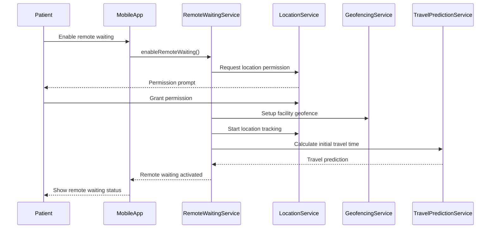
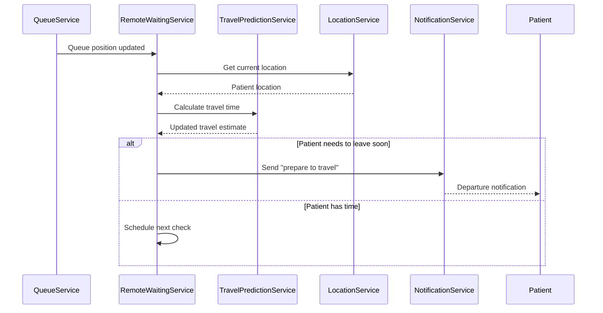

# Remote Waiting - Technical Design

## Architecture Overview

### Remote Waiting System Components
```
┌─────────────────────────────────────────────────────────────┐
│                 Remote Waiting Orchestrator                 │
│              (Coordinates all remote services)              │
└─────────────────────┬───────────────────────────────────────┘
                      │
┌─────────────────────┼───────────────────────────────────────┐
│  Location Services  │  Arrival Prediction  │ Notification  │
│                     │                       │   Timing      │
│ • GPS Tracking      │ • Travel Time Calc    │               │
│ • Geofencing        │ • Traffic Integration │ • Smart Alerts│
│ • Battery Optim     │ • Route Optimization  │ • Escalation  │
└─────────────────────┼───────────────────────┼───────────────┘
                      │                       │
┌─────────────────────┼───────────────────────┼───────────────┐
│   External APIs     │     Data Storage      │   Queue       │
│                     │                       │ Integration   │
│ • Google Maps       │ • Location History    │               │
│ • Apple Maps        │ • Travel Patterns     │ • Position    │
│ • Traffic Services  │ • Geofence Config     │   Updates     │
│ • Weather APIs      │ • User Preferences    │ • Status Sync │
└─────────────────────┴───────────────────────┴───────────────┘
```

## Data Models

### Remote Waiting Session
```typescript
interface RemoteWaitingSession {
  id: string;
  patientId: string;
  queueId: string;
  facilityId: string;
  status: 'active' | 'traveling' | 'arrived' | 'cancelled' | 'expired';
  configuration: {
    maxDistanceMiles: number;
    preferredBufferMinutes: number;
    enableLocationTracking: boolean;
    notificationPreferences: RemoteNotificationPrefs;
  };
  location: {
    currentLocation?: GeoPoint;
    lastUpdated?: Date;
    accuracy?: number; // meters
    batteryOptimized: boolean;
  };
  travel: {
    estimatedTravelMinutes: number;
    suggestedDepartureTime: Date;
    optimalArrivalTime: Date;
    currentTrafficFactor: number;
    lastRouteUpdate: Date;
  };
  geofencing: {
    facilityGeofence: GeofenceConfig;
    arrivalDetected: boolean;
    arrivalConfirmed: boolean;
    arrivalConfirmationTime?: Date;
  };
  notifications: {
    lastPrepareTravelSent?: Date;
    lastArrivalPromptSent?: Date;
    escalationLevel: number;
    nextScheduledNotification?: Date;
  };
  createdAt: Date;
  updatedAt: Date;
  expiresAt: Date;
}

interface GeoPoint {
  latitude: number;
  longitude: number;
  altitude?: number;
  accuracy?: number;
  timestamp: Date;
}

interface GeofenceConfig {
  center: GeoPoint;
  radiusMeters: number;
  type: 'arrival' | 'parking' | 'building_entrance';
  isActive: boolean;
  entryActions: string[];
  exitActions: string[];
}
```

### Travel Prediction Model
```typescript
interface TravelPrediction {
  sessionId: string;
  origin: GeoPoint;
  destination: GeoPoint;
  predictions: {
    optimistic: TravelEstimate;
    realistic: TravelEstimate;
    pessimistic: TravelEstimate;
  };
  selectedEstimate: 'optimistic' | 'realistic' | 'pessimistic';
  factors: {
    baseDistance: number; // meters
    historicalAverage: number; // minutes
    currentTraffic: number; // multiplier
    weatherImpact: number; // multiplier
    timeOfDay: number; // multiplier
    dayOfWeek: number; // multiplier
  };
  routes: Array<{
    provider: 'google' | 'apple' | 'here';
    duration: number; // minutes
    distance: number; // meters
    trafficDelay: number; // minutes
    route: string; // encoded polyline
  }>;
  confidence: number; // 0-1
  calculatedAt: Date;
  validUntil: Date;
}

interface TravelEstimate {
  durationMinutes: number;
  arrivalTime: Date;
  departureTime: Date;
  confidence: number;
}
```

### Location Tracking Configuration
```typescript
interface LocationTrackingConfig {
  patientId: string;
  isEnabled: boolean;
  accuracy: 'high' | 'medium' | 'low' | 'battery_saver';
  updateInterval: number; // seconds
  geofences: GeofenceConfig[];
  privacySettings: {
    shareWithFacility: boolean;
    retentionDays: number;
    anonymizeAfterDays: number;
  };
  batteryOptimization: {
    enabled: boolean;
    reducedAccuracyThreshold: number; // battery percentage
    backgroundUpdateLimit: number; // updates per hour
  };
}
```

## Service Implementation

### Remote Waiting Service
```typescript
export class RemoteWaitingService {
  constructor(
    private locationService: LocationService,
    private travelPredictionService: TravelPredictionService,
    private notificationService: NotificationService,
    private queueService: QueueService,
    private geofencingService: GeofencingService
  ) {}

  async enableRemoteWaiting(
    patientId: string,
    queueId: string,
    preferences: RemoteWaitingPreferences
  ): Promise<RemoteWaitingSession> {
    // Verify patient is in queue
    const queuePosition = await this.queueService.getPatientPosition(patientId, queueId);
    if (!queuePosition) {
      throw new Error('Patient not found in queue');
    }

    // Check if remote waiting is available for this queue
    const queue = await this.queueService.getQueue(queueId);
    if (!queue.configuration.remoteWaitingEnabled) {
      throw new Error('Remote waiting not available for this queue');
    }

    // Create remote waiting session
    const session: RemoteWaitingSession = {
      id: this.generateId(),
      patientId,
      queueId,
      facilityId: queue.facilityId,
      status: 'active',
      configuration: {
        maxDistanceMiles: preferences.maxDistanceMiles || 20,
        preferredBufferMinutes: preferences.bufferMinutes || 10,
        enableLocationTracking: preferences.enableLocationTracking,
        notificationPreferences: preferences.notifications
      },
      location: {
        batteryOptimized: preferences.batteryOptimized || true
      },
      travel: {
        estimatedTravelMinutes: 0,
        suggestedDepartureTime: new Date(),
        optimalArrivalTime: new Date(),
        currentTrafficFactor: 1.0,
        lastRouteUpdate: new Date()
      },
      geofencing: {
        facilityGeofence: await this.getFacilityGeofence(queue.facilityId),
        arrivalDetected: false,
        arrivalConfirmed: false
      },
      notifications: {
        escalationLevel: 0
      },
      createdAt: new Date(),
      updatedAt: new Date(),
      expiresAt: new Date(Date.now() + 8 * 60 * 60 * 1000) // 8 hours
    };

    await this.sessionRepository.save(session);

    // Initialize location tracking if enabled
    if (preferences.enableLocationTracking) {
      await this.locationService.startTracking(patientId, session.id);
    }

    // Set up geofencing
    await this.geofencingService.addGeofence(
      patientId,
      session.geofencing.facilityGeofence
    );

    // Schedule initial travel calculation
    await this.scheduleInitialTravelCalculation(session.id);

    return session;
  }

  async updatePatientLocation(
    sessionId: string,
    location: GeoPoint
  ): Promise<void> {
    const session = await this.getSession(sessionId);
    if (!session || session.status === 'cancelled' || session.status === 'expired') {
      return;
    }

    // Update session with new location
    session.location.currentLocation = location;
    session.location.lastUpdated = new Date();
    session.updatedAt = new Date();

    // Recalculate travel time if location change is significant
    const previousLocation = session.location.currentLocation;
    if (!previousLocation || this.calculateDistance(previousLocation, location) > 500) { // 500 meters
      await this.updateTravelPrediction(session);
    }

    // Check geofence triggers
    await this.checkGeofenceTriggers(session, location);

    await this.sessionRepository.save(session);

    // Publish location update event
    await this.eventPublisher.publish('remote_waiting.location_updated', {
      sessionId: session.id,
      patientId: session.patientId,
      location,
      travelEstimate: session.travel.estimatedTravelMinutes
    });
  }

  private async updateTravelPrediction(session: RemoteWaitingSession): Promise<void> {
    if (!session.location.currentLocation) {
      return;
    }

    const facility = await this.getFacility(session.facilityId);
    const prediction = await this.travelPredictionService.calculateTravelTime(
      session.location.currentLocation,
      facility.location,
      {
        timeOfDay: new Date().getHours(),
        dayOfWeek: new Date().getDay(),
        weatherConditions: await this.getWeatherConditions(facility.location),
        trafficEnabled: true
      }
    );

    // Update session with new travel prediction
    session.travel = {
      estimatedTravelMinutes: prediction.selectedEstimate.durationMinutes,
      suggestedDepartureTime: prediction.selectedEstimate.departureTime,
      optimalArrivalTime: prediction.selectedEstimate.arrivalTime,
      currentTrafficFactor: prediction.factors.currentTraffic,
      lastRouteUpdate: new Date()
    };

    // Recalculate notification timing
    await this.rescheduleNotifications(session);
  }

  async confirmArrival(sessionId: string): Promise<void> {
    const session = await this.getSession(sessionId);
    if (!session) {
      throw new Error('Remote waiting session not found');
    }

    // Update session status
    session.status = 'arrived';
    session.geofencing.arrivalConfirmed = true;
    session.geofencing.arrivalConfirmationTime = new Date();
    session.updatedAt = new Date();

    await this.sessionRepository.save(session);

    // Notify queue service of arrival
    await this.queueService.confirmPatientArrival(session.patientId, session.queueId);

    // Stop location tracking
    await this.locationService.stopTracking(session.patientId);

    // Clean up geofences
    await this.geofencingService.removeGeofences(session.patientId);

    // Publish arrival event
    await this.eventPublisher.publish('remote_waiting.arrival_confirmed', {
      sessionId: session.id,
      patientId: session.patientId,
      queueId: session.queueId,
      arrivalTime: new Date()
    });
  }
}
```

### Location Tracking Service
```typescript
export class LocationService {
  constructor(
    private redis: Redis,
    private locationRepository: LocationRepository
  ) {}

  async startTracking(patientId: string, sessionId: string): Promise<void> {
    const trackingConfig: LocationTrackingConfig = {
      patientId,
      isEnabled: true,
      accuracy: 'medium',
      updateInterval: 30, // 30 seconds
      geofences: await this.getPatientGeofences(patientId),
      privacySettings: {
        shareWithFacility: true,
        retentionDays: 7,
        anonymizeAfterDays: 30
      },
      batteryOptimization: {
        enabled: true,
        reducedAccuracyThreshold: 20, // 20% battery
        backgroundUpdateLimit: 120 // 2 per minute max
      }
    };

    await this.redis.setex(
      `location_tracking:${patientId}`,
      8 * 60 * 60, // 8 hours
      JSON.stringify(trackingConfig)
    );
  }

  async updateLocation(
    patientId: string,
    location: GeoPoint,
    batteryLevel?: number
  ): Promise<void> {
    const config = await this.getTrackingConfig(patientId);
    if (!config?.isEnabled) {
      return;
    }

    // Apply battery optimization
    if (batteryLevel && batteryLevel < config.batteryOptimization.reducedAccuracyThreshold) {
      location.accuracy = Math.max(location.accuracy || 100, 200); // Reduce accuracy to save battery
    }

    // Rate limiting check
    const lastUpdate = await this.redis.get(`location_last_update:${patientId}`);
    if (lastUpdate) {
      const timeSinceLastUpdate = Date.now() - parseInt(lastUpdate);
      if (timeSinceLastUpdate < config.updateInterval * 1000) {
        return; // Too soon for another update
      }
    }

    // Store location
    await this.locationRepository.store({
      patientId,
      location,
      timestamp: new Date(),
      accuracy: location.accuracy,
      batteryLevel
    });

    // Cache current location
    await this.redis.setex(
      `current_location:${patientId}`,
      300, // 5 minutes
      JSON.stringify(location)
    );

    // Update last update timestamp
    await this.redis.set(`location_last_update:${patientId}`, Date.now().toString());

    // Trigger location-based services
    await this.processLocationUpdate(patientId, location);
  }

  private async processLocationUpdate(patientId: string, location: GeoPoint): Promise<void> {
    // Check geofences
    const geofences = await this.getActiveGeofences(patientId);
    for (const geofence of geofences) {
      const wasInside = await this.redis.get(`geofence_status:${patientId}:${geofence.id}`);
      const isInside = this.isPointInGeofence(location, geofence);

      if (isInside && !wasInside) {
        // Entered geofence
        await this.handleGeofenceEntry(patientId, geofence, location);
        await this.redis.set(`geofence_status:${patientId}:${geofence.id}`, 'inside');
      } else if (!isInside && wasInside) {
        // Exited geofence
        await this.handleGeofenceExit(patientId, geofence, location);
        await this.redis.del(`geofence_status:${patientId}:${geofence.id}`);
      }
    }

    // Update remote waiting sessions
    const remoteSessions = await this.getActiveRemoteSessions(patientId);
    for (const session of remoteSessions) {
      await this.remoteWaitingService.updatePatientLocation(session.id, location);
    }
  }

  private isPointInGeofence(point: GeoPoint, geofence: GeofenceConfig): boolean {
    const distance = this.calculateDistance(point, geofence.center);
    return distance <= geofence.radiusMeters;
  }

  private calculateDistance(point1: GeoPoint, point2: GeoPoint): number {
    const R = 6371000; // Earth's radius in meters
    const φ1 = point1.latitude * Math.PI / 180;
    const φ2 = point2.latitude * Math.PI / 180;
    const Δφ = (point2.latitude - point1.latitude) * Math.PI / 180;
    const Δλ = (point2.longitude - point1.longitude) * Math.PI / 180;

    const a = Math.sin(Δφ/2) * Math.sin(Δφ/2) +
              Math.cos(φ1) * Math.cos(φ2) *
              Math.sin(Δλ/2) * Math.sin(Δλ/2);
    const c = 2 * Math.atan2(Math.sqrt(a), Math.sqrt(1-a));

    return R * c; // Distance in meters
  }
}
```

### Travel Prediction Service
```typescript
export class TravelPredictionService {
  constructor(
    private googleMapsService: GoogleMapsService,
    private trafficService: TrafficService,
    private weatherService: WeatherService,
    private mlService: MachineLearningService
  ) {}

  async calculateTravelTime(
    origin: GeoPoint,
    destination: GeoPoint,
    context: TravelContext
  ): Promise<TravelPrediction> {
    // Get multiple route predictions
    const routes = await Promise.all([
      this.googleMapsService.getRoute(origin, destination, context),
      this.getHistoricalAverage(origin, destination, context),
      this.mlService.predictTravelTime(origin, destination, context)
    ]);

    // Calculate different scenarios
    const baseTime = routes[0].duration;
    const trafficMultiplier = await this.getTrafficMultiplier(origin, destination);
    const weatherMultiplier = await this.getWeatherMultiplier(destination);

    const predictions = {
      optimistic: {
        durationMinutes: Math.round(baseTime * 0.9),
        arrivalTime: new Date(),
        departureTime: new Date(),
        confidence: 0.7
      },
      realistic: {
        durationMinutes: Math.round(baseTime * trafficMultiplier * weatherMultiplier),
        arrivalTime: new Date(),
        departureTime: new Date(),
        confidence: 0.85
      },
      pessimistic: {
        durationMinutes: Math.round(baseTime * trafficMultiplier * weatherMultiplier * 1.3),
        arrivalTime: new Date(),
        departureTime: new Date(),
        confidence: 0.6
      }
    };

    // Select best estimate based on context
    const selectedEstimate = this.selectBestEstimate(predictions, context);

    return {
      sessionId: context.sessionId,
      origin,
      destination,
      predictions,
      selectedEstimate,
      factors: {
        baseDistance: routes[0].distance,
        historicalAverage: routes[1]?.duration || baseTime,
        currentTraffic: trafficMultiplier,
        weatherImpact: weatherMultiplier,
        timeOfDay: this.getTimeOfDayFactor(context.timeOfDay),
        dayOfWeek: this.getDayOfWeekFactor(context.dayOfWeek)
      },
      routes: routes.map(route => ({
        provider: route.provider,
        duration: route.duration,
        distance: route.distance,
        trafficDelay: route.trafficDelay || 0,
        route: route.encodedPolyline
      })),
      confidence: predictions[selectedEstimate].confidence,
      calculatedAt: new Date(),
      validUntil: new Date(Date.now() + 10 * 60 * 1000) // 10 minutes
    };
  }

  private async getTrafficMultiplier(origin: GeoPoint, destination: GeoPoint): Promise<number> {
    const trafficData = await this.trafficService.getCurrentTraffic(origin, destination);
    
    // Convert traffic severity to multiplier
    const severityMultipliers = {
      'light': 1.1,
      'moderate': 1.3,
      'heavy': 1.6,
      'severe': 2.0
    };

    return severityMultipliers[trafficData.severity] || 1.0;
  }

  private async getWeatherMultiplier(location: GeoPoint): Promise<number> {
    const weather = await this.weatherService.getCurrentWeather(location);
    
    const weatherMultipliers = {
      'clear': 1.0,
      'rain': 1.2,
      'snow': 1.5,
      'fog': 1.3,
      'storm': 1.8
    };

    return weatherMultipliers[weather.condition] || 1.0;
  }

  private selectBestEstimate(
    predictions: any,
    context: TravelContext
  ): 'optimistic' | 'realistic' | 'pessimistic' {
    // Use realistic by default
    let selected: 'optimistic' | 'realistic' | 'pessimistic' = 'realistic';

    // Adjust based on context
    if (context.urgencyLevel === 'high') {
      selected = 'pessimistic'; // Be conservative for urgent situations
    } else if (context.urgencyLevel === 'low') {
      selected = 'optimistic'; // Can take more risk for routine appointments
    }

    // Factor in patient preferences
    if (context.patientRiskPreference === 'conservative') {
      selected = 'pessimistic';
    } else if (context.patientRiskPreference === 'aggressive') {
      selected = 'optimistic';
    }

    return selected;
  }
}
```

## Sequence Diagrams

### Remote Waiting Activation Flow


### Smart Arrival Notification Flow


## Implementation Considerations

### Battery Optimization
```typescript
export class BatteryOptimizedLocationService {
  async optimizeLocationTracking(
    patientId: string,
    batteryLevel: number,
    isCharging: boolean
  ): Promise<LocationTrackingConfig> {
    const baseConfig = await this.getTrackingConfig(patientId);
    
    if (batteryLevel > 50 || isCharging) {
      // High accuracy mode
      return {
        ...baseConfig,
        accuracy: 'high',
        updateInterval: 30, // 30 seconds
        backgroundUpdateLimit: 120 // No limit when battery is good
      };
    } else if (batteryLevel > 20) {
      // Balanced mode
      return {
        ...baseConfig,
        accuracy: 'medium',
        updateInterval: 60, // 1 minute
        backgroundUpdateLimit: 60 // 1 per minute
      };
    } else {
      // Battery saver mode
      return {
        ...baseConfig,
        accuracy: 'low',
        updateInterval: 300, // 5 minutes
        backgroundUpdateLimit: 12 // 1 per 5 minutes
      };
    }
  }

  async handleLowBatteryMode(patientId: string): Promise<void> {
    // Switch to SMS-only notifications
    await this.notificationService.switchToSMSOnly(patientId);
    
    // Reduce location update frequency
    await this.setMinimalTracking(patientId);
    
    // Notify patient of reduced functionality
    await this.notificationService.sendLowBatteryAlert(patientId);
  }
}
```

### Geofencing Implementation
```typescript
export class GeofencingService {
  constructor(
    private redis: Redis,
    private eventPublisher: EventPublisher
  ) {}

  async addGeofence(patientId: string, geofence: GeofenceConfig): Promise<void> {
    const key = `geofences:${patientId}`;
    const geofences = await this.getPatientGeofences(patientId);
    
    geofences.push(geofence);
    
    await this.redis.setex(
      key,
      8 * 60 * 60, // 8 hours
      JSON.stringify(geofences)
    );
  }

  async checkGeofenceEvent(
    patientId: string,
    location: GeoPoint
  ): Promise<GeofenceEvent[]> {
    const geofences = await this.getPatientGeofences(patientId);
    const events: GeofenceEvent[] = [];

    for (const geofence of geofences) {
      const isInside = this.isLocationInGeofence(location, geofence);
      const wasInside = await this.getPreviousGeofenceStatus(patientId, geofence.id);

      if (isInside && !wasInside) {
        events.push({
          type: 'entry',
          patientId,
          geofenceId: geofence.id,
          location,
          timestamp: new Date()
        });
        
        await this.updateGeofenceStatus(patientId, geofence.id, true);
      } else if (!isInside && wasInside) {
        events.push({
          type: 'exit',
          patientId,
          geofenceId: geofence.id,
          location,
          timestamp: new Date()
        });
        
        await this.updateGeofenceStatus(patientId, geofence.id, false);
      }
    }

    // Publish events
    for (const event of events) {
      await this.eventPublisher.publish('geofence.event', event);
    }

    return events;
  }

  private isLocationInGeofence(location: GeoPoint, geofence: GeofenceConfig): boolean {
    const distance = this.calculateDistance(location, geofence.center);
    return distance <= geofence.radiusMeters;
  }
}
```

### Privacy and Data Management
```typescript
export class LocationPrivacyService {
  constructor(
    private locationRepository: LocationRepository,
    private encryptionService: EncryptionService
  ) {}

  async storeLocationSecurely(
    patientId: string,
    location: GeoPoint,
    retentionPolicy: LocationRetentionPolicy
  ): Promise<void> {
    const encryptedLocation = await this.encryptionService.encrypt(JSON.stringify({
      latitude: location.latitude,
      longitude: location.longitude,
      timestamp: location.timestamp
    }));

    await this.locationRepository.store({
      patientId,
      encryptedData: encryptedLocation,
      accuracy: location.accuracy,
      timestamp: location.timestamp,
      expiresAt: new Date(Date.now() + retentionPolicy.retentionDays * 24 * 60 * 60 * 1000)
    });
  }

  async anonymizeExpiredLocations(): Promise<void> {
    const expiredLocations = await this.locationRepository.findExpiredLocations();
    
    for (const location of expiredLocations) {
      // Replace precise coordinates with general area
      const generalArea = this.getGeneralArea(location);
      
      await this.locationRepository.update(location.id, {
        patientId: null, // Remove patient association
        encryptedData: null,
        generalArea,
        anonymizedAt: new Date()
      });
    }
  }

  async purgeLocationData(patientId: string): Promise<void> {
    // Complete data deletion when patient withdraws consent
    await this.locationRepository.deleteByPatient(patientId);
    await this.redis.del(`location_tracking:${patientId}`);
    await this.redis.del(`current_location:${patientId}`);
    
    // Log deletion for compliance
    await this.auditService.logDataDeletion({
      patientId,
      dataType: 'location',
      deletedAt: new Date(),
      reason: 'patient_consent_withdrawal'
    });
  }
}
```