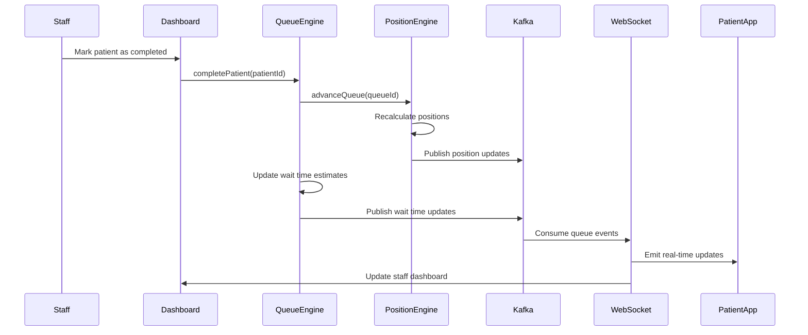
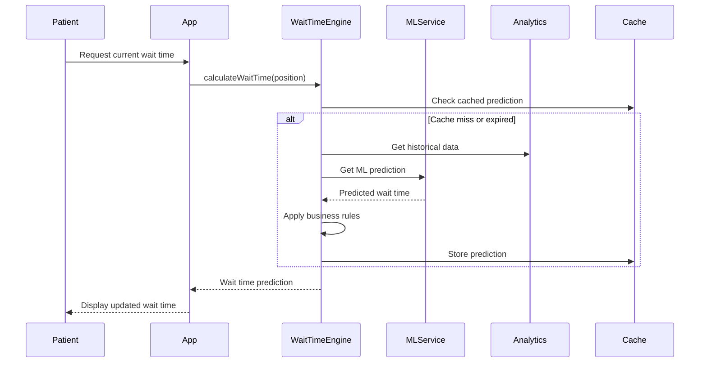

# Virtual Queue Management - Technical Design

## Architecture Overview

### Core Components
```
┌─────────────────────────────────────────────────────────────┐
│                   Queue Management Layer                    │
├─────────────────┬─────────────────┬─────────────────────────┤
│  Queue Engine   │ Position Engine │   Wait Time Engine     │
│                 │                 │                         │
│ • Queue CRUD    │ • Position      │ • Time Estimation      │
│ • Capacity Mgmt │   Tracking      │ • ML Predictions       │
│ • Priority Rules│ • Real-time     │ • Historical Analysis  │
│                 │   Updates       │                         │
└─────────────────┴─────────────────┴─────────────────────────┘
                              │
┌─────────────────────────────────────────────────────────────┐
│                   Event Streaming Layer                     │
│                      (Apache Kafka)                         │
└─────────────────────────────────────────────────────────────┘
                              │
┌─────────────────┬─────────────────┬─────────────────────────┤
│   Data Layer    │   Cache Layer   │    External Systems     │
│                 │                 │                         │
│ • PostgreSQL    │ • Redis         │ • EHR Integration      │
│ • Queue State   │ • Session Data  │ • Notification Service │
│ • Patient Data  │ • Real-time     │ • Analytics Platform   │
│ • Audit Logs    │   Position      │                         │
└─────────────────┴─────────────────┴─────────────────────────┘
```

## Data Models

### Queue Entity
```typescript
interface Queue {
  id: string;
  facilityId: string;
  appointmentType: string;
  serviceArea?: string;
  status: 'active' | 'paused' | 'closed';
  capacity: {
    maximum: number;
    current: number;
    waitlistLimit: number;
  };
  configuration: {
    averageProcessingMinutes: number;
    priorityEnabled: boolean;
    waitlistEnabled: boolean;
    estimationAlgorithm: 'simple' | 'ml_enhanced' | 'historical';
  };
  staff: {
    assignedProviders: string[];
    availableProviders: number;
    avgProviderSpeed: number; // patients per hour
  };
  metrics: {
    totalProcessedToday: number;
    averageWaitTime: number;
    currentThroughput: number;
    lastProcessedAt?: Date;
  };
  createdAt: Date;
  updatedAt: Date;
}
```

### Queue Position Entity
```typescript
interface QueuePosition {
  id: string;
  queueId: string;
  patientId: string;
  position: number;
  priority: number; // 1-10, lower number = higher priority
  status: 'waiting' | 'called' | 'in_progress' | 'completed' | 'no_show' | 'removed';
  joinedAt: Date;
  estimatedCallTime: Date;
  estimatedWaitMinutes: number;
  actualWaitMinutes?: number;
  metadata: {
    appointmentType: string;
    reasonForVisit: string;
    specialNeeds?: string[];
    isWalkIn: boolean;
    originalEstimate: number;
  };
  statusHistory: Array<{
    status: string;
    timestamp: Date;
    changedBy: string;
    reason?: string;
  }>;
  notifications: {
    lastSent?: Date;
    nextScheduled?: Date;
    preference: 'sms' | 'email' | 'push' | 'all';
  };
}
```

### Wait Time Prediction Model
```typescript
interface WaitTimePrediction {
  patientId: string;
  queueId: string;
  baseEstimate: number; // minutes
  adjustedEstimate: number; // minutes
  confidence: number; // 0-1
  factors: {
    currentPosition: number;
    averageProcessingTime: number;
    timeOfDay: number; // hour
    dayOfWeek: number;
    seasonalFactor: number;
    staffEfficiency: number;
    appointmentComplexity: number;
  };
  historicalAccuracy: {
    lastPredictionError: number; // minutes
    averageAccuracy: number; // percentage
    predictionCount: number;
  };
  calculatedAt: Date;
  nextRecalculation: Date;
}
```

## Service Architecture

### Queue Engine
```typescript
export class QueueEngine {
  constructor(
    private queueRepository: QueueRepository,
    private positionRepository: PositionRepository,
    private eventPublisher: EventPublisher,
    private notificationService: NotificationService
  ) {}

  async addPatientToQueue(request: JoinQueueRequest): Promise<QueuePosition> {
    const queue = await this.queueRepository.findById(request.queueId);
    
    if (!queue) {
      throw new QueueNotFoundError(request.queueId);
    }

    if (!this.canJoinQueue(queue, request)) {
      throw new QueueCapacityError(queue.id);
    }

    const position = await this.assignQueuePosition(queue, request);
    const estimatedWait = await this.calculateWaitTime(position);

    position.estimatedWaitMinutes = estimatedWait.adjustedEstimate;
    position.estimatedCallTime = new Date(Date.now() + estimatedWait.adjustedEstimate * 60000);

    await this.positionRepository.save(position);

    // Publish queue update event
    await this.eventPublisher.publish('queue.patient.added', {
      queueId: queue.id,
      patientId: request.patientId,
      position: position.position,
      estimatedWait: estimatedWait.adjustedEstimate
    });

    // Update queue metrics
    await this.updateQueueMetrics(queue.id);

    return position;
  }

  async advanceQueue(queueId: string, completedPatientId: string): Promise<void> {
    const completedPosition = await this.positionRepository.findByPatientAndQueue(
      completedPatientId, 
      queueId
    );

    if (!completedPosition) {
      throw new PositionNotFoundError(completedPatientId, queueId);
    }

    // Mark patient as completed
    await this.updatePositionStatus(completedPosition.id, 'completed');

    // Get all waiting patients after the completed position
    const waitingPositions = await this.positionRepository.findWaitingAfterPosition(
      queueId, 
      completedPosition.position
    );

    // Advance all positions by 1
    const updates = waitingPositions.map(pos => ({
      ...pos,
      position: pos.position - 1
    }));

    await this.positionRepository.bulkUpdate(updates);

    // Recalculate wait times for affected patients
    await this.recalculateWaitTimes(queueId);

    // Publish advancement event
    await this.eventPublisher.publish('queue.advanced', {
      queueId,
      completedPatientId,
      affectedPositions: updates.length
    });

    // Notify next few patients
    await this.notifyUpcomingPatients(queueId);
  }

  private async calculateWaitTime(position: QueuePosition): Promise<WaitTimePrediction> {
    const queue = await this.queueRepository.findById(position.queueId);
    const positionsAhead = position.position - 1;
    
    // Base calculation: positions ahead × average processing time
    const baseEstimate = positionsAhead * queue.configuration.averageProcessingMinutes;
    
    // Apply machine learning adjustments if available
    const mlAdjustment = await this.getMlWaitTimeAdjustment(position);
    
    // Apply time-of-day and historical factors
    const timeFactors = await this.getTimeFactors(queue.facilityId);
    
    const adjustedEstimate = Math.max(
      1, // Minimum 1 minute
      Math.round(baseEstimate * mlAdjustment * timeFactors.efficiency)
    );

    return {
      patientId: position.patientId,
      queueId: position.queueId,
      baseEstimate,
      adjustedEstimate,
      confidence: mlAdjustment > 0 ? 0.8 : 0.6,
      factors: {
        currentPosition: position.position,
        averageProcessingTime: queue.configuration.averageProcessingMinutes,
        timeOfDay: new Date().getHours(),
        dayOfWeek: new Date().getDay(),
        seasonalFactor: timeFactors.seasonal,
        staffEfficiency: timeFactors.efficiency,
        appointmentComplexity: this.getComplexityFactor(position.metadata.appointmentType)
      },
      historicalAccuracy: await this.getHistoricalAccuracy(position.queueId),
      calculatedAt: new Date(),
      nextRecalculation: new Date(Date.now() + 300000) // 5 minutes
    };
  }
}
```

### Position Engine
```typescript
export class PositionEngine {
  constructor(
    private positionRepository: PositionRepository,
    private redis: Redis,
    private eventPublisher: EventPublisher
  ) {}

  async updatePositionsRealTime(queueId: string): Promise<void> {
    const lockKey = `queue_lock:${queueId}`;
    const lockValue = `${Date.now()}-${Math.random()}`;
    
    // Acquire distributed lock to prevent race conditions
    const acquired = await this.redis.set(lockKey, lockValue, 'PX', 5000, 'NX');
    
    if (!acquired) {
      console.log(`Queue ${queueId} is locked, skipping update`);
      return;
    }

    try {
      await this.performPositionUpdate(queueId);
    } finally {
      // Release lock
      const currentLock = await this.redis.get(lockKey);
      if (currentLock === lockValue) {
        await this.redis.del(lockKey);
      }
    }
  }

  private async performPositionUpdate(queueId: string): Promise<void> {
    // Get all active positions sorted by priority and join time
    const positions = await this.positionRepository.findActiveByQueue(queueId);
    
    // Re-number positions to ensure no gaps
    const updates: Array<{ id: string; newPosition: number }> = [];
    
    positions.forEach((position, index) => {
      const newPosition = index + 1;
      if (position.position !== newPosition) {
        updates.push({ id: position.id, newPosition });
      }
    });

    if (updates.length > 0) {
      await this.positionRepository.bulkUpdatePositions(updates);
      
      // Cache updated positions for fast access
      await this.cacheQueuePositions(queueId, positions);
      
      // Publish real-time updates
      await this.publishPositionUpdates(queueId, updates);
    }
  }

  async getRealtimePosition(patientId: string, queueId: string): Promise<QueuePosition | null> {
    // Try cache first for sub-second response
    const cachedPosition = await this.redis.get(`position:${patientId}:${queueId}`);
    
    if (cachedPosition) {
      return JSON.parse(cachedPosition);
    }

    // Fallback to database
    const position = await this.positionRepository.findByPatientAndQueue(patientId, queueId);
    
    if (position) {
      // Cache for 30 seconds
      await this.redis.setex(
        `position:${patientId}:${queueId}`,
        30,
        JSON.stringify(position)
      );
    }

    return position;
  }
}
```

### Wait Time Engine
```typescript
export class WaitTimeEngine {
  constructor(
    private analyticsService: AnalyticsService,
    private mlService: MachineLearningService
  ) {}

  async calculateEstimatedWaitTime(
    position: QueuePosition,
    queue: Queue
  ): Promise<WaitTimePrediction> {
    // Gather input features for prediction
    const features = await this.gatherPredictionFeatures(position, queue);
    
    // Get base estimate using simple calculation
    const baseEstimate = this.calculateBaseWaitTime(position, queue);
    
    // Apply machine learning adjustments if model is available
    let adjustedEstimate = baseEstimate;
    let confidence = 0.6;

    if (await this.mlService.hasTrainedModel(queue.facilityId)) {
      const mlPrediction = await this.mlService.predictWaitTime(features);
      adjustedEstimate = mlPrediction.waitTimeMinutes;
      confidence = mlPrediction.confidence;
    }

    // Apply business rules and constraints
    adjustedEstimate = this.applyBusinessRules(adjustedEstimate, features);

    return {
      patientId: position.patientId,
      queueId: position.queueId,
      baseEstimate,
      adjustedEstimate,
      confidence,
      factors: features,
      historicalAccuracy: await this.getHistoricalAccuracy(queue.id),
      calculatedAt: new Date(),
      nextRecalculation: new Date(Date.now() + 300000) // 5 minutes
    };
  }

  private async gatherPredictionFeatures(
    position: QueuePosition,
    queue: Queue
  ): Promise<PredictionFeatures> {
    const now = new Date();
    const facility = await this.getFacility(queue.facilityId);
    
    return {
      currentPosition: position.position,
      averageProcessingTime: queue.configuration.averageProcessingMinutes,
      timeOfDay: now.getHours(),
      dayOfWeek: now.getDay(),
      seasonalFactor: this.getSeasonalFactor(now),
      staffEfficiency: await this.getStaffEfficiencyFactor(queue.id),
      appointmentComplexity: this.getAppointmentComplexity(position.metadata.appointmentType),
      facilityBusyness: await this.getFacilityBusynessFactor(queue.facilityId),
      historicalWaitTimes: await this.getHistoricalWaitTimes(queue.id, now),
      currentQueueVelocity: await this.calculateQueueVelocity(queue.id),
      specialNeeds: position.metadata.specialNeeds?.length || 0,
      isWalkIn: position.metadata.isWalkIn ? 1 : 0
    };
  }

  private calculateBaseWaitTime(position: QueuePosition, queue: Queue): number {
    const positionsAhead = Math.max(0, position.position - 1);
    const baseTime = positionsAhead * queue.configuration.averageProcessingMinutes;
    
    // Add buffer for system processing time
    const bufferTime = Math.ceil(baseTime * 0.1); // 10% buffer
    
    return baseTime + bufferTime;
  }

  private applyBusinessRules(estimate: number, features: PredictionFeatures): number {
    let adjusted = estimate;

    // Minimum wait time (never show 0)
    adjusted = Math.max(1, adjusted);

    // Cap maximum realistic wait time
    adjusted = Math.min(480, adjusted); // 8 hours max

    // Round to reasonable increments
    if (adjusted <= 5) {
      adjusted = Math.ceil(adjusted);
    } else if (adjusted <= 60) {
      adjusted = Math.ceil(adjusted / 5) * 5; // Round to 5-minute increments
    } else {
      adjusted = Math.ceil(adjusted / 15) * 15; // Round to 15-minute increments
    }

    return adjusted;
  }
}
```

## Real-Time Update System

### Event-Driven Updates
```typescript
// Kafka event producer for queue changes
export class QueueEventPublisher {
  constructor(private kafka: Kafka) {}

  async publishPositionUpdate(event: PositionUpdateEvent): Promise<void> {
    const message = {
      key: event.queueId,
      value: JSON.stringify({
        eventType: 'queue.position.updated',
        timestamp: new Date().toISOString(),
        queueId: event.queueId,
        patientId: event.patientId,
        oldPosition: event.oldPosition,
        newPosition: event.newPosition,
        estimatedWait: event.estimatedWait
      }),
      headers: {
        'event-version': 'v1',
        'source': 'queue-engine'
      }
    };

    const producer = this.kafka.producer();
    await producer.send({
      topic: 'queue-updates',
      messages: [message]
    });
  }

  async publishWaitTimeUpdate(event: WaitTimeUpdateEvent): Promise<void> {
    const message = {
      key: event.queueId,
      value: JSON.stringify({
        eventType: 'queue.waittime.updated',
        timestamp: new Date().toISOString(),
        queueId: event.queueId,
        affectedPatients: event.affectedPatients.map(p => ({
          patientId: p.patientId,
          oldEstimate: p.oldEstimate,
          newEstimate: p.newEstimate
        }))
      })
    };

    const producer = this.kafka.producer();
    await producer.send({
      topic: 'queue-updates',
      messages: [message]
    });
  }
}
```

### WebSocket Real-Time Client
```typescript
// WebSocket service for real-time updates
export class QueueWebSocketService {
  private io: Server;
  private kafka: Kafka;

  constructor(server: any) {
    this.io = new Server(server, {
      cors: {
        origin: process.env.ALLOWED_ORIGINS?.split(','),
        credentials: true
      }
    });

    this.setupEventHandlers();
    this.setupKafkaConsumer();
  }

  private setupEventHandlers(): void {
    this.io.on('connection', (socket) => {
      console.log(`Client connected: ${socket.id}`);

      socket.on('join-queue-room', (queueId: string) => {
        socket.join(`queue:${queueId}`);
        console.log(`Client ${socket.id} joined queue room: ${queueId}`);
      });

      socket.on('join-patient-room', (patientId: string) => {
        socket.join(`patient:${patientId}`);
        console.log(`Client ${socket.id} joined patient room: ${patientId}`);
      });

      socket.on('disconnect', () => {
        console.log(`Client disconnected: ${socket.id}`);
      });
    });
  }

  private async setupKafkaConsumer(): Promise<void> {
    const consumer = this.kafka.consumer({ groupId: 'websocket-notifications' });
    
    await consumer.subscribe({ topics: ['queue-updates', 'wait-time-updates'] });

    await consumer.run({
      eachMessage: async ({ topic, message }) => {
        const event = JSON.parse(message.value!.toString());
        
        switch (event.eventType) {
          case 'queue.position.updated':
            await this.handlePositionUpdate(event);
            break;
          case 'queue.waittime.updated':
            await this.handleWaitTimeUpdate(event);
            break;
          case 'queue.patient.called':
            await this.handlePatientCalled(event);
            break;
        }
      }
    });
  }

  private async handlePositionUpdate(event: any): Promise<void> {
    // Send to specific patient room
    this.io.to(`patient:${event.patientId}`).emit('position-updated', {
      position: event.newPosition,
      estimatedWait: event.estimatedWait,
      queueId: event.queueId
    });

    // Send to queue room for staff dashboard
    this.io.to(`queue:${event.queueId}`).emit('queue-updated', {
      patientId: event.patientId,
      newPosition: event.newPosition
    });
  }
}
```

## Queue Algorithms

### Priority Queue Implementation
```typescript
export class PriorityQueueManager {
  async insertWithPriority(
    queueId: string,
    patient: QueuePatient,
    priority: number
  ): Promise<number> {
    const existingPositions = await this.positionRepository.findActiveByQueue(queueId);
    
    // Sort by priority (ascending) then by join time
    existingPositions.sort((a, b) => {
      if (a.priority !== b.priority) {
        return a.priority - b.priority; // Lower number = higher priority
      }
      return a.joinedAt.getTime() - b.joinedAt.getTime();
    });

    // Find insertion point
    let insertPosition = existingPositions.length + 1;
    
    for (let i = 0; i < existingPositions.length; i++) {
      if (priority < existingPositions[i].priority) {
        insertPosition = i + 1;
        break;
      }
    }

    // Shift positions for patients after insertion point
    const shiftsNeeded = existingPositions.slice(insertPosition - 1);
    
    if (shiftsNeeded.length > 0) {
      await this.shiftPositions(shiftsNeeded, 1);
    }

    return insertPosition;
  }

  private async shiftPositions(positions: QueuePosition[], shift: number): Promise<void> {
    const updates = positions.map(pos => ({
      id: pos.id,
      position: pos.position + shift
    }));

    await this.positionRepository.bulkUpdatePositions(updates);

    // Notify affected patients of position changes
    for (const update of updates) {
      await this.notifyPositionChange(update.id, update.position);
    }
  }
}
```

### Machine Learning Integration
```typescript
export class WaitTimeMlService {
  constructor(private mlClient: MLClient) {}

  async predictWaitTime(features: PredictionFeatures): Promise<MLPrediction> {
    const modelInput = this.formatFeaturesForModel(features);
    
    try {
      const prediction = await this.mlClient.predict(modelInput);
      
      return {
        waitTimeMinutes: Math.round(prediction.output),
        confidence: prediction.confidence,
        modelVersion: prediction.modelVersion,
        features: modelInput
      };
    } catch (error) {
      console.warn('ML prediction failed, falling back to heuristic:', error);
      
      // Fallback to rule-based calculation
      return this.fallbackPrediction(features);
    }
  }

  async trainModel(facilityId: string): Promise<void> {
    const trainingData = await this.gatherTrainingData(facilityId);
    
    if (trainingData.length < 100) {
      console.log(`Insufficient training data for facility ${facilityId}: ${trainingData.length} samples`);
      return;
    }

    const model = await this.mlClient.trainModel({
      facilityId,
      data: trainingData,
      algorithm: 'gradient_boosting',
      hyperparameters: {
        max_depth: 6,
        learning_rate: 0.1,
        n_estimators: 100
      }
    });

    await this.deployModel(facilityId, model);
  }

  private async gatherTrainingData(facilityId: string): Promise<TrainingData[]> {
    // Get historical queue data for past 90 days
    const endDate = new Date();
    const startDate = new Date(endDate.getTime() - 90 * 24 * 60 * 60 * 1000);

    return await this.analyticsService.getHistoricalQueueData({
      facilityId,
      startDate,
      endDate,
      includeFeatures: true,
      includeOutcomes: true
    });
  }
}
```

## Sequence Diagrams

### Queue Position Update Flow


### Wait Time Calculation Flow


## Performance Optimization

### Caching Strategy
```typescript
export class QueueCacheManager {
  constructor(private redis: Redis) {}

  async cacheQueueSnapshot(queueId: string): Promise<void> {
    const positions = await this.positionRepository.findActiveByQueue(queueId);
    const snapshot = {
      positions: positions.map(p => ({
        patientId: p.patientId,
        position: p.position,
        estimatedWait: p.estimatedWaitMinutes
      })),
      lastUpdated: new Date().toISOString(),
      totalCount: positions.length
    };

    await this.redis.setex(
      `queue_snapshot:${queueId}`,
      60, // 1 minute TTL
      JSON.stringify(snapshot)
    );
  }

  async getQueueSnapshot(queueId: string): Promise<QueueSnapshot | null> {
    const cached = await this.redis.get(`queue_snapshot:${queueId}`);
    return cached ? JSON.parse(cached) : null;
  }

  // Cache frequently requested wait time predictions
  async cacheWaitTimePrediction(
    patientId: string,
    queueId: string,
    prediction: WaitTimePrediction
  ): Promise<void> {
    const key = `waittime:${patientId}:${queueId}`;
    const ttl = 300; // 5 minutes

    await this.redis.setex(key, ttl, JSON.stringify(prediction));
  }
}
```

### Database Optimization
```sql
-- Materialized view for queue statistics
CREATE MATERIALIZED VIEW queue_stats AS
SELECT 
    q.id as queue_id,
    q.facility_id,
    q.appointment_type,
    COUNT(qp.id) as current_size,
    AVG(qp.estimated_wait_minutes) as avg_wait_time,
    MIN(qp.joined_at) as oldest_patient,
    MAX(qp.joined_at) as newest_patient
FROM queues q
LEFT JOIN queue_positions qp ON q.id = qp.queue_id 
    AND qp.status = 'waiting'
GROUP BY q.id, q.facility_id, q.appointment_type;

-- Refresh materialized view every minute
CREATE OR REPLACE FUNCTION refresh_queue_stats()
RETURNS void AS $$
BEGIN
    REFRESH MATERIALIZED VIEW CONCURRENTLY queue_stats;
END;
$$ LANGUAGE plpgsql;

-- Automated refresh
SELECT cron.schedule('refresh-queue-stats', '* * * * *', 'SELECT refresh_queue_stats();');
```

## Error Handling and Recovery

### Queue State Recovery
```typescript
export class QueueRecoveryService {
  async recoverQueueState(queueId: string): Promise<void> {
    console.log(`Starting queue state recovery for ${queueId}`);

    // Step 1: Identify inconsistencies
    const inconsistencies = await this.detectQueueInconsistencies(queueId);
    
    if (inconsistencies.length === 0) {
      console.log(`No inconsistencies found for queue ${queueId}`);
      return;
    }

    // Step 2: Create recovery plan
    const recoveryPlan = this.createRecoveryPlan(inconsistencies);
    
    // Step 3: Execute recovery with rollback capability
    const transaction = await this.database.beginTransaction();
    
    try {
      for (const step of recoveryPlan.steps) {
        await this.executeRecoveryStep(step, transaction);
      }
      
      await transaction.commit();
      console.log(`Queue ${queueId} recovery completed successfully`);
      
      // Notify affected patients
      await this.notifyRecoveryComplete(queueId, recoveryPlan);
      
    } catch (error) {
      await transaction.rollback();
      console.error(`Queue ${queueId} recovery failed:`, error);
      throw new QueueRecoveryError(queueId, error.message);
    }
  }

  private async detectQueueInconsistencies(queueId: string): Promise<QueueInconsistency[]> {
    const issues: QueueInconsistency[] = [];
    
    // Check for duplicate positions
    const duplicatePositions = await this.findDuplicatePositions(queueId);
    if (duplicatePositions.length > 0) {
      issues.push({
        type: 'duplicate_positions',
        severity: 'high',
        details: duplicatePositions
      });
    }

    // Check for position gaps
    const positionGaps = await this.findPositionGaps(queueId);
    if (positionGaps.length > 0) {
      issues.push({
        type: 'position_gaps',
        severity: 'medium',
        details: positionGaps
      });
    }

    // Check for orphaned positions
    const orphanedPositions = await this.findOrphanedPositions(queueId);
    if (orphanedPositions.length > 0) {
      issues.push({
        type: 'orphaned_positions',
        severity: 'low',
        details: orphanedPositions
      });
    }

    return issues;
  }
}
```

## Monitoring and Observability

### Queue Metrics Collection
```typescript
export class QueueMetricsCollector {
  constructor(private metricsClient: MetricsClient) {}

  async collectQueueMetrics(queueId: string): Promise<void> {
    const queue = await this.queueRepository.findById(queueId);
    const positions = await this.positionRepository.findActiveByQueue(queueId);

    // Basic queue metrics
    this.metricsClient.gauge('queue.current_size', positions.length, {
      queue_id: queueId,
      facility_id: queue.facilityId,
      appointment_type: queue.appointmentType
    });

    this.metricsClient.gauge('queue.capacity_utilization', 
      positions.length / queue.capacity.maximum, {
        queue_id: queueId
      });

    // Wait time metrics
    const avgWaitTime = positions.reduce((sum, p) => sum + p.estimatedWaitMinutes, 0) / positions.length;
    this.metricsClient.gauge('queue.average_wait_time', avgWaitTime || 0, {
      queue_id: queueId
    });

    // Processing velocity
    const throughput = await this.calculateThroughput(queueId);
    this.metricsClient.gauge('queue.throughput', throughput, {
      queue_id: queueId
    });
  }

  private async calculateThroughput(queueId: string): Promise<number> {
    const oneHourAgo = new Date(Date.now() - 60 * 60 * 1000);
    const completedCount = await this.positionRepository.countCompletedSince(queueId, oneHourAgo);
    return completedCount; // patients per hour
  }
}
```

### Health Monitoring
```typescript
export class QueueHealthMonitor {
  async checkQueueHealth(queueId: string): Promise<HealthStatus> {
    const health: HealthStatus = {
      queueId,
      status: 'healthy',
      issues: [],
      recommendations: [],
      checkedAt: new Date()
    };

    // Check for stalled queues
    const lastActivity = await this.getLastQueueActivity(queueId);
    if (lastActivity && Date.now() - lastActivity.getTime() > 30 * 60 * 1000) { // 30 minutes
      health.issues.push({
        type: 'stalled_queue',
        severity: 'medium',
        message: 'No queue activity for 30+ minutes'
      });
      health.recommendations.push('Check staff availability and system connectivity');
    }

    // Check for extreme wait times
    const maxWaitTime = await this.getMaxWaitTime(queueId);
    if (maxWaitTime > 120) { // 2 hours
      health.issues.push({
        type: 'excessive_wait_time',
        severity: 'high',
        message: `Maximum wait time: ${maxWaitTime} minutes`
      });
      health.recommendations.push('Consider adding staff or opening additional queues');
    }

    // Check prediction accuracy
    const accuracy = await this.getRecentPredictionAccuracy(queueId);
    if (accuracy < 0.7) { // Less than 70% accurate
      health.issues.push({
        type: 'poor_prediction_accuracy',
        severity: 'low',
        message: `Wait time prediction accuracy: ${(accuracy * 100).toFixed(1)}%`
      });
      health.recommendations.push('Retrain wait time prediction model');
    }

    health.status = health.issues.length === 0 ? 'healthy' : 
                   health.issues.some(i => i.severity === 'high') ? 'critical' : 'warning';

    return health;
  }
}
```